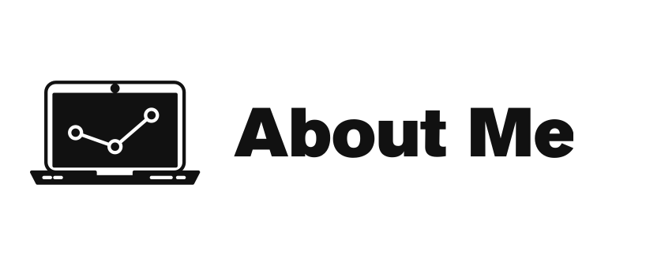

## My History
From an early age I’ve always been deeply interested in science and engineering, The first time I used a computer right at the beginning of the computer revolution I wanted to know how these mysterious machines worked. Thus began my journey into the World of IT and computing learning how to program learning how to build computers. And how a passion for technology turned into a career.

# 🎓 Education History

| Course            | Award   | Establishment              | Year        |
| :--               | :--     | :--                        | :--         |
| Computer Science  | MSC     | University of Essex        | 2021 -  |
| Computing         | BSC     | University of Portsmouth   | 1999 - 2001 |
| Computing         | A Level | Portsmouth College         | 1996 - 1998 |
| Chemistry         | A Level | Portsmouth College         | 1996 - 1998 |
| Biology           | A Level | Portsmouth College         | 1996 - 1998 |

# 🏆 Certifications 

| Qualification                 | Awarding Body | Year    |
| :-----------                  | :---------    | :------ |
| A+                            | CompTIA       | 2001    |
| Entry Level Python Programmer | PECP          | 2020    |
| Data Science Tools            | IBM           | 2021    |
| Cloud Core                    | IBM           | 2021    |
| Docker Essentials             | IBM           | 2021    |
| Big Data Foundations          | IBM           | 2021    |
