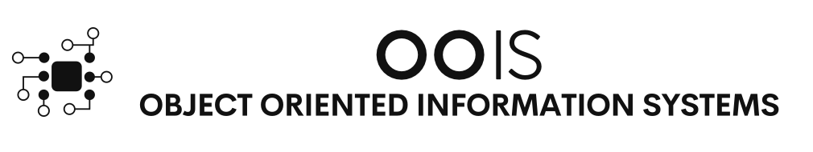

[1](/MyPortfolio/OOIS/Unit01.html) | [2](/MyPortfolio/OOIS/Unit02.html) | [3](/MyPortfolio/OOIS/Unit03.html) | [4](/MyPortfolio/OOIS/Unit04.html) | [5](/MyPortfolio/OOIS/Unit05.html) | [6](/MyPortfolio/OOIS/Unit06.html) | [7](/MyPortfolio/OOIS/Unit07.html) | [8](/MyPortfolio/OOIS/Unit08.html) | [9](/MyPortfolio/OOIS/Unit09.html) | [10](/MyPortfolio/OOIS/Unit10.html) | [11](/MyPortfolio/OOIS/Unit11.html) | [12](/MyPortfolio/OOIS/Unit12.html)

### Week Two [week Duo]

In Week two we continued to look at the reasons why Information systems fail and had the first Zoom meeting of the module where we covered a couple of cases of IT systems failures along with finding out that fighter Jets 🛩 have USB ports 😀 that was a new one. 

**Key Weekly Learning**

### Part of a Information System

A Information System is made up of 5 parts

1. Hardware
2. Software
3. Data
4. People
5. Process

| Name | Description |
| :--  | :--         |
| Technology | The application of scientific knowledge for practical purposes |
| Hardware   | Hardware is the part of an information system you can touch    |
| Software   | a set of instructions that tells the hardware what to do       |
| Data       | a collection of facts                                          |
| Process    | a series of steps undertaken to achieve a desired outcome or goal |

(Bourgeois, D. (2014) Chapter 1)

### The Role of Information Systems

- Take data and turn it into information, and then transform that into organizational knowledge

| ERA | Hardware | Operating System | Applications |
| :-- | :--      | :--              | :--          |
| Mainframe 1970s | Terminals connected to mainframe computer. | Time-sharing (TSO) on MVS | Custom-written MRP software |
| PC Mid 1980s    | IBM PC Compatible                          | MS DOS                    | WordPerfect / Lotus 123     |
| Client Server Late 80s / Early 90s | IBM PC clone on Novell Netware | Windows for Workgroups | Microsoft Word & Microsoft Excel |
| WWW Mid 90s / Eary 2000s | IBM PC Clone | Windows XP | Micosoft Office / Internet Explorer |
| Web 2.0 Mid 2000 to present | Laptop conencted to WI-Fi | Windows 7 | Microsoft office / Firefox |
| Today and beyond | Apple IPAD | IOS | Mobile Apps |

 along with the meeting I continued to engage by making follow up posts to the posts made last week my posts for this week are as follows :-

### Week Two Forum Posts

**Post 1**

Hi Michael an interesting read especially the bit about the root cause of the outage being down to a storage failure. While we know any device with physical components such as Hard Drives will fail. BlackBlaze one of the cloud storage providers even does an annual report on failure Rates (https://www.backblaze.com/blog/backblaze-hard-drive-stats-q2-2020/) between drives. This can and should and should be accounted for in an organisations Disaster Recovery (DR) and Business Continuity Planning (BCP) Plan.

Also being how the solution was based on a VMware technology stack meant that VMware technology such as VMware High Availability (HA) and VMware Vmotion that enable migration of a live VM to a new host could also have been used to mitigate some of the risk of a failure causing an outage. The Human factor also appears to be at play here with the design setup and configuration of the system not matching the actual business requirements for High availability 24/7 operation.

these technical white papers from VMware explain how the technology that would have been available in this case could have mitigated some of the impact but technology is no replacement for having effective system monitoring and maintenance procedures and a plan that has been tested that can be put into action in the event of a problem.

https://www.vmware.com/content/dam/digitalmarketing/vmware/en/pdf/techpaper/vmw-server-wp-bestpractices-white-paper.pdf (Anon)

https://www.vmware.com/content/dam/digitalmarketing/vmware/en/pdf/techpaper/vmware-vmotion-performance-vsphere5.pdf (Anon)

**Reference List**

VMware ® High Availability (VMware HA): Deployment Best Practices VMware ® vSphere TM 4.1. [Accessed 17 August 2021a].
VMware vSphere ® vMotion ® Architecture, Performance and Best Practices in VMware vSphere ® 5. [Accessed 17 August 2021b].

**Post Two**

Good Discussion  While sat here ironically dealing with my own post upgrade IT systems failure from the examples we have all provided there does not appear to be one absolute cause of system failures they mostly seem to stem from a cascade of failures both technological factors and human factors but I think from the example we have we can split the failures into a couple of categories.

Hardware Failure Simplest of the reasons of a system failure the underlying hardware that supports the Information system either is not up to the tasks being demanded of it (Capacity Planning) good paper on that subject [https://www.oocities.org/mtarrani/PredictingComputingCapacity.pdf] (Shallahamer) or planning for hardware component failure has not taken place during the development and implementation phase of the life cycle. Also, this one that the easiest to plan for during a system implementation.

Software Error Bugs or Issues that were not picked up during the development of the system that leads to the failure of the system while no software is perfect having unit testing & stress testing as a core part of the development process can overcome a lot of these issues or at least that is the conventional wisdom until I started reading around the subject in the paper On the Relation Between Unit Testing and Code Quality (Gren and Antinyan, 2017) They Find “if files have 100% or 0% unit test coverage, the differences in defects between these two groups only showed a small effect. The effect size was as low as 2.9%, therefore, the assumed causal relationship between unit tests and code quality is dubious”

And Finally End user error or what used to be described in less enlighten times as a PEBKAC (Problem Exists Between Keyboard and Chair) error which can be unfair as a lot of times these errors are a result of users of the system having inadequate training and guidance on how to use the system which could have been overcome with a proper induction and user training plan.

Ian 

**References**

Gren, L. and Antinyan, V. (2017). On the Relation Between Unit Testing and Code Quality. In: August 2017. [Online]. Available at: doi:10.1109/SEAA.2017.36.
Shallahamer, C. A. PREDICTING COMPUTING SYSTEM CAPACITY AND THROUGHPUT.

**Weekly Skills Matrix New Knowledge Gained**

- [x] Even Greater understanding of the Cause of IT Systems Failures ☹️
- [X] Introduction to UML
