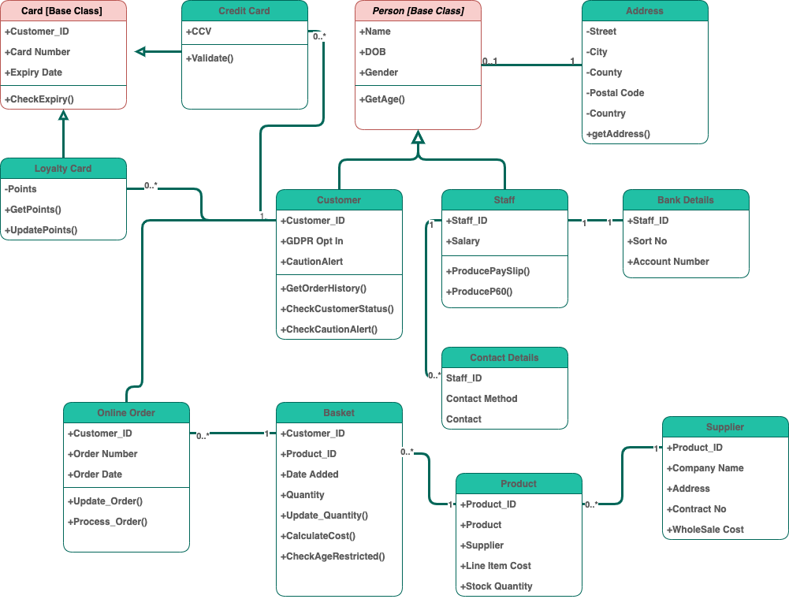

[1](/MyPortfolio/OOIS/Unit01.html) | [2](/MyPortfolio/OOIS/Unit02.html) | [3](/MyPortfolio/OOIS/Unit03.html) | [4](/MyPortfolio/OOIS/Unit04.html) | [5](/MyPortfolio/OOIS/Unit05.html) | [6](/MyPortfolio/OOIS/Unit06.html) | [7](/MyPortfolio/OOIS/Unit07.html) | [8](/MyPortfolio/OOIS/Unit08.html) | [9](/MyPortfolio/OOIS/Unit09.html) | [10](/MyPortfolio/OOIS/Unit10.html) | [11](/MyPortfolio/OOIS/Unit11.html) | [12](/MyPortfolio/OOIS/Unit12.html)

### Week Three [tres sabbati]

This week has mostly been reading and looking at Python OO some interesting concepts that I will be putting into practice when it comes time to create my web application for the assessment part of the course had a good meeting and picked up some useful python tips. I Also started looking at UML and UML diagrams that would be neededfor our assessment. As someone who was once banned from taking GCSE art just happy we can use digital tooling to produce our designs.

- Class Diagram
- Sequence Diagram
- Activity Diagram
- State Machine Diagram

I am happy with most of the concepts and what the diagram is trying to do apart from the state machine diagram which the examples show physical devices light bulb etc so taking a while to understand that one so will have to do some more reading on the subject before I start creating my diagrams. 

During this week I  had a go at the excerise and produced a class Diagram for a SuperMarket 

**SuperMarket Data Diagram**

While an ok attempt was I was not 100% happy with how this turned out so went back to basics and produced another diagram that I was a lot happier with still room for improvement but moving in the right direction. 

**Weekly Skills Matrix New Knowledge Gained**

- [x] Python and Python OO
- [X] Data Diagrams

**Happiness Level**

😀😀😀😀

