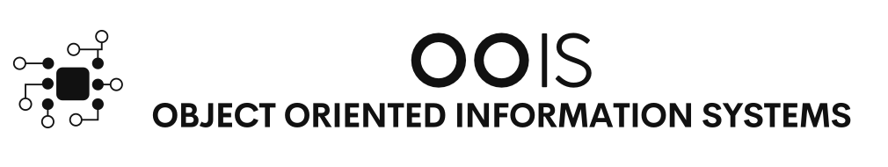

[1](/MyPortfolio/OOIS/Unit01.html) | [2](/MyPortfolio/OOIS/Unit02.html) | [3](/MyPortfolio/OOIS/Unit03.html) | [4](/MyPortfolio/OOIS/Unit04.html) | [5](/MyPortfolio/OOIS/Unit05.html) | [6](/MyPortfolio/OOIS/Unit06.html) | [7](/MyPortfolio/OOIS/Unit07.html) | [8](/MyPortfolio/OOIS/Unit08.html) | [9](/MyPortfolio/OOIS/Unit09.html) | [10](/MyPortfolio/OOIS/Unit10.html) | [11](/MyPortfolio/OOIS/Unit11.html) | [12](/MyPortfolio/OOIS/Unit12.html)

### Week Three [tres sabbati]

This week has mostly been reading and lookign at Python OO some interesting concepts that I will be putting into practice when it comes time to create my web application for the assessment part of the course. Also started looking at UML and UML diagrams for our assessment work we will need

- Class Diagram
- Sequence Diagram
- Activity Diagram
- State Machine Diagram

Also Maybe a Database ERD diagram happy with most of the concepts and what the diagram is trying to do apart from the state machine diagram which the examples show physical devices light bulb etc so taking a while to understand that one so will have to do some more reading on the subject before I start creating my diagrams.

Also had a go at the excerise and produced a Diagram for a SuperMarket 

**SuperMarket Data Diagram**

**Weekly Skills Matrix New Knowledge Gained**

- [x] Python and Python OO
- [X] Data Diagrams

**Happiness Level**

😀😀😀😀

