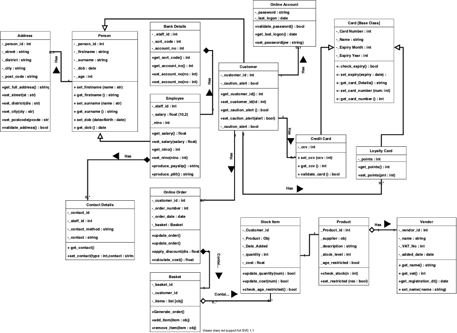

[1](/MyPortfolio/OOIS/Unit01.html) | [2](/MyPortfolio/OOIS/Unit02.html) | [3](/MyPortfolio/OOIS/Unit03.html) | [4](/MyPortfolio/OOIS/Unit04.html) | [5](/MyPortfolio/OOIS/Unit05.html) | [6](/MyPortfolio/OOIS/Unit06.html) | [7](/MyPortfolio/OOIS/Unit07.html) | [8](/MyPortfolio/OOIS/Unit08.html) | [9](/MyPortfolio/OOIS/Unit09.html) | [10](/MyPortfolio/OOIS/Unit10.html) | [11](/MyPortfolio/OOIS/Unit11.html) | [12](/MyPortfolio/OOIS/Unit12.html)

### Week Five [Hebdomada Quinque]

This week I was looking at UML and in particular class diagrams I think after some practice the concept of UML and diagrams is beginning to click and the diagram, I produces for this week’s exercise Week 5 Diagrams I was quite happy with how it turned out. Having produced diagrams in colour and B&W still undecided if adding colour aids or distracts from the information the diagram is suppose to convey. Will investigate further before I submit the first piece of accessed work. Still feeling positive on how the module is going though am beginning to wonder why there are so may different types of UML diagrams have also been looking at the different options for software to be used to create diagrams think I am going with draw.io as this appears to meet my needs outlook is still positive 

**Weekly Skills Matrix New Knowledge Gained**

- [x] UML Diagram Types
- [X] Software Tools For UML

**Artifacts**

**Happiness Level**

😀😀😀😀

