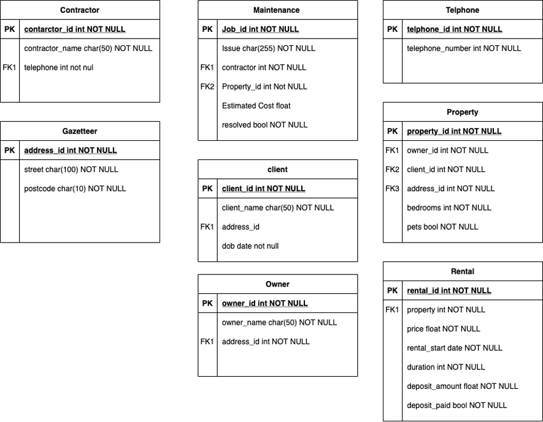

[1](/MyPortfolio/OOIS/Unit01.html) | [2](/MyPortfolio/OOIS/Unit02.html) | [3](/MyPortfolio/OOIS/Unit03.html) | [4](/MyPortfolio/OOIS/Unit04.html) | [5](/MyPortfolio/OOIS/Unit05.html) | [6](/MyPortfolio/OOIS/Unit06.html) | [7](/MyPortfolio/OOIS/Unit07.html) | [8](/MyPortfolio/OOIS/Unit08.html) | [9](/MyPortfolio/OOIS/Unit09.html) | [10](/MyPortfolio/OOIS/Unit10.html) | [11](/MyPortfolio/OOIS/Unit11.html) | [12](/MyPortfolio/OOIS/Unit12.html)

### Week Seven [Hebdomada septem]

Moved on to Database design this is a very interesting topic and with databases underpinning modern life quite important found the topics of nomination a bit confusing at times but managed to work though the issues and now have a much greater understanding of how databases should be constructed to maximise how data is stored the exercises as part of this week’s work was to produce a ERD Week 7 Diagrams this turned out to be a interesting exercise with many ways it could be achieved. Also got some good feedback over the use of a table to Store a Gazetteer Forum Reply to Question about using Gazetteer Table Databases fall in my comfort zone so quite happy this week. 

Also Submitted First assignment this week ran to my usual problem of doubting what I had produced and wanting to produce another version but made the decision to submit what I had produced but as with most work cannot say it is ever truly done as there is always something you can add but it gets to a point where you have to release it into the wild for others to see. 

**Artifacts**

**Forum reply**

Forum Reply to Question about using Gazetteer Table

Thanks for the comment I have been lucky enough to have worked with systems that use proper gazetteers. For the lager systems an address gazetteer either local or national depending on requirements is a must the only downside is the data used to populate it is quite expensive for a commercial licence. In the UK addresses are usually held in BS7666 format which is the UK format for a local land and property gazetteer (LLPG). 

You tend to populate a gazetteer table with an initial data feed from a data provider such as ordnance survey then once your main gazetteer is populated usually 4 times a year you then do a COU (Change only Update) to bring in new and changed address data. The advantage using a populated gazetteer rather than user entered address data is 
1. it enables you to do the usual lookup an address by postcode in the system along with also ensuring address data is recorded in a consistent format across the system while also ensuring that only validated official addresses can be entered as opposed to local names and non-official addresses. 
2. It also means that as in any database you are storing a link to an address rather than the address itself if the official name changes when we update the gazetteer any records linked to that address will also have the new updated name without having to be manually edited. 

**Weekly Skills Matrix New Knowledge Gained**

- [x] DataBases
- [X] Database ERD

**Happiness Level**

😀😀😀
