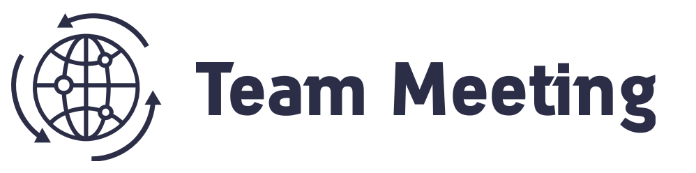

# 25 November 2021 / 6pm GMT #
## Attendees ##
Alice, Ian, Aidan    Apologies: Lukman
## Agenda ##
Draft of the Pentesting Plan
Section 3/4 needs some more details - specifically about the GDPR, ISO, Payment Card
Parts of the Projects - who wants to cover what
Alice had made a draft assignment - we all need to look into Section 4 and section 7.
Lukman is going to make the timeline.

## Notes ##
We  spoke about the outline of the project and have a couple of questions for Nawaz about it. What do we need to put in for the access part (seeing as it is our website and we don’t really need to ask for permission)? Do we need to include social engineering attacks? If so, in what section?
Action Items
Make comments on initial draft of project.
Give Nawaz a draft of the proposal so we can get some initial feedback.
Aidan will research about regulatory compliance in section 4.
Ian will present his results for the presentation in Seminar 2 about the initial tests that he carried out.
Next Meeting Agenda
Start the practical scanning jobs. Decide who is doing what!

