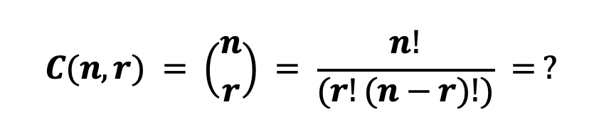
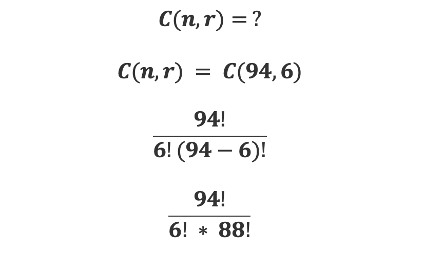
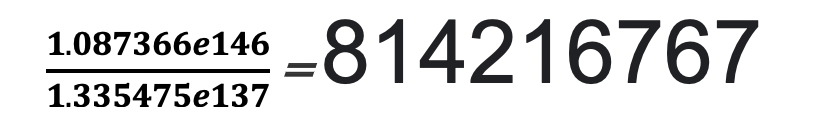

# Calculate permutations of Password #

### Known Facts ###

Password between 6 – 20 Characters
ASCII lower case + upper case + digits + symbols = 94 possible characters

Example 6 Digit Password Possible Combinations

We can calculate the possible combinations of a 6 character password using the following mathematical formula 

Where  N = number of objects and R = sample size in this case to work out the Solution that would give the number of unique 6 character passwords we would 

8 hundred and 14 Million 216 Thousand Six Hundred and 67 possible combinations

References :

Zwillinger, Daniel (Editor-in-Chief). CRC Standard Mathematical Tables and Formulae, 31st Edition New York, NY: CRC Press,2003.

