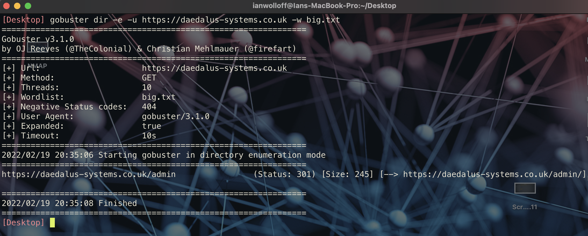

[1](/MyPortfolio/PCOM7E/Unit01.html) | [2](/MyPortfolio/PCOM7E/Unit02.html) | [3](/MyPortfolio/PCOM7E/Unit03.html) | [4](/MyPortfolio/PCOM7E/Unit04.html) | [5](/MyPortfolio/PCOM7E/Unit05.html) | [6](/MyPortfolio/PCOM7E/Unit06.html) | [7](/MyPortfolio/PCOM7E/Unit07.html) | [8](/MyPortfolio/PCOM7E/Unit08.html) | [9](/MyPortfolio/PCOM7E/Unit09.html) | [10](/MyPortfolio/PCOM7E/Unit10.html) | [11](/MyPortfolio/PCOM7E/Unit11.html) | [12](/MyPortfolio/PCOM7E/Unit12.html)
### Week Four [week Hebdomada quattuor]
Really interesting week Looking at TCP/IP and the OSI stack being old enough to have used systems that did not use TCP/IP (Novell Netware) IPX it was nice to see the theory behind networking and the Network Stack. The OSI model was also brand new content so learning about that was quite new to me but in some ways I think it actually makes more sense then the TCP/IP model but personally I dont think we will will be using it anytime soon as even if the OSI model is a better model the TCP model is just too intergrated now and the advantages of the OSI model would not justify the change. Very Similar to the video wars of the 1980s (VHS & Betamax) Betamax was the technicaly better solution but lost due to VHS having market share. This could be said is the same between OSI and TCP models.

OSI MODEL
--
|Layer|Description|
|---|---|
| 7 | Application|
| 6 | Presentation|
| 5 | Session|
| 4 | Transport|
| 3 | Network|
| 2 | Data Link|
| 1 | Physical|
 
 Imperva (2021)

TCP MODEL
--
|Layer|Description|
|---|---|
| 4 |Application|
| 3 | Transport|
| 2 | Internet|
| 1 | Network Access|

This week we contunued our team work on the first phase of the project along with also putting some building blocks in place for phase two which included for this week leaning how to use NMAP ([NMAP ](/MyPortfolio/PCOM7E/NMAP.html)) from the command line rather then using the more limited GUI and also playing around with the DirBuster and GoBuster tools used to identify public folders that are accessible on a web server.

### GoBuster ###



This week I also did some learning on the key TCP/IP tools to be found on a device (Ping , nslookup , dig , traceroute) though these tools date back to the beginning of the network age they are still very useful tools which is why they remain in use today. I used these tools to track down the location of our webserver for one of the excerises this I enjoyed as it was part learning the tooling but also part detective work.

**Location of WebServer**

To Determine this there are a number of techniques that can be used but the one used here is using the lookup of IP address to geographic location for this a python script was written that takes a dictionary of IP addresses obtained from our traceroute and using the dataset provided by freegeoip returns information about the IP address based on the whois record that allows us to determine the location of the site.
```Python
import json
import urllib.request
import socket

IP_Address = ["62.115.120.238", "209.124.94.237"]
Resolver = "https://freegeoip.app/json/"

try:
    for hop, ip in enumerate(IP_Address):
        with urllib.request.urlopen(Resolver + ip) as url:
            data = json.loads(url.read().decode())
            print("Hop Number:" + str(hop))
            print("IP Address:" + data["ip"]
            print("Country Code:" + data["country_code"])
            print("Country Name:" + data["country_name"])
            print("Time Zone:" + data["time_zone"])
            print("Latitude:" + str(data["latitude"]))
            print("Longitude:" + str(data["longitude"]) + "\n")

except urllib.request.URLError:
    print("Error Getting Data")

except KeyError:
    print("Error Getting JSON Key")
```

This Returns the Folloing

| Hop Number| 0            |
|---|---                      |
| IP Address   | 192.168.0.1  |
| Country Code |              |
| Country Name |              |
| Time Zone    |              |
| Latitude     | 0            |
| Longitude    | 0            |


**References**

Imperva https://www.imperva.com/learn/application-security/osi-model/ (2021)

**Weekly Skills Matrix New Knowledge Gained**

- [x] Security Tooling (NMAP , DirBuster , GoBuster)
- [X] Nerwork Tooling (Ping , nslookup , Dig, Traceroute)
- [X] TCP/IP and OSI Model 

**Happiness Level**

😀😀😀😀
