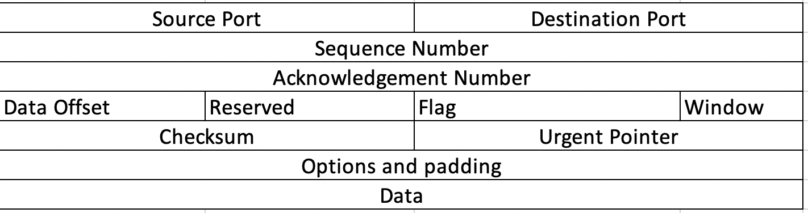

[1](/MyPortfolio/PCOM7E/Unit01.html) | [2](/MyPortfolio/PCOM7E/Unit02.html) | [3](/MyPortfolio/PCOM7E/Unit03.html) | [4](/MyPortfolio/PCOM7E/Unit04.html) | [5](/MyPortfolio/PCOM7E/Unit05.html) | [6](/MyPortfolio/PCOM7E/Unit06.html) | [7](/MyPortfolio/PCOM7E/Unit07.html) | [8](/MyPortfolio/PCOM7E/Unit08.html) | [9](/MyPortfolio/PCOM7E/Unit09.html) | [10](/MyPortfolio/PCOM7E/Unit10.html) | [11](/MyPortfolio/PCOM7E/Unit11.html) | [12](/MyPortfolio/PCOM7E/Unit12.html)
### Week Five [week Hebdomada Quinque]

This week has mostly been a project week with setting the direction of the project work this has been going well and the team I am in appears to be a good team full of people who know what is needed in order to deliver a successful project. 

We are going to try and divide the project into the following stages to align with some project management best practice

<ul>
  <li>Definition</li>
<li>Initiation</li>
<li>Planning</li>
<li>Execution</li>
<li>Monitoring & Control</li>
<li>Closure</li>
</ul>

I have also been looking in more detail at TCP/IP networking using wirehark and tcpdump to look at the data at the packet level while not 100% happy with my understanding at the moment was interesting to see the data being trasmitted by our devices and how this can potentialy be captured and analysed. 
### TCP Packet Structure


**TCP DUMP**

Example output from the command line version of TCP dump showing packet capture from the en0 (Wireless) adapter

```console
sudo tcpdump -vv -i en0
```


## Observation ##

I appear to have graviated towards being the technicial person on the team this was not itentional but probably because I created some initial tests first as a way to learn the tooling for myself but I am not against the role being asked of me as I have always been a person who like to understand how something works. But I am concerned / mindful that I dont want to take the chance away from another member of the team. I will happily take the role along as im not affeccting other members growth.

**Weekly Skills Matrix New Knowledge Gained**

- [x] Project Planning
- [X] Network Packet Capture (Wireshark , TCPDUMP and PCAP files)
- [X] TCP/IP Packet Structure

**Happiness Level**

😀😀😀
