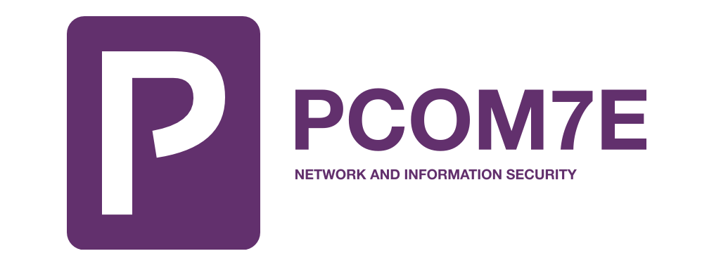

[1](/MyPortfolio/PCOM7E/Unit01.html) | [2](/MyPortfolio/PCOM7E/Unit02.html) | [3](/MyPortfolio/PCOM7E/Unit03.html) | [4](/MyPortfolio/PCOM7E/Unit04.html) | [5](/MyPortfolio/PCOM7E/Unit05.html) | [6](/MyPortfolio/PCOM7E/Unit06.html) | [7](/MyPortfolio/PCOM7E/Unit07.html) | [8](/MyPortfolio/PCOM7E/Unit08.html) | [9](/MyPortfolio/PCOM7E/Unit09.html) | [10](/MyPortfolio/PCOM7E/Unit10.html) | [11](/MyPortfolio/PCOM7E/Unit11.html) | [12](/MyPortfolio/PCOM7E/Unit12.html)
### Week Nine [week Hebdomada Octo]

This week introduced us to logging and digital forensics logs are vital for understanding what has happened in the event of a secuity event or even in the event of a system problem logs act as the digital fingerprints to allow you to see what the system did and when it did it

What is the purpose of Logging the UK ICO says on the subject "It is to enable you to monitor and audit internal processing within any automated processing systems you use, and to know which third parties you have shared data with so that you can inform them of changes to the data should you need to. In addition, logging enables you to monitor systems for inappropriate access and/or disclosure of data, to verify the lawfulness of any processing, and to ensure the integrity and security of personal data." (ICO https://ico.org.uk/for-organisations/guide-to-data-protection/guide-to-le-processing/accountability-and-governance/logging/)

When Logging information what we log can generally be split into the 4Ws 

## Who ##
Who (user) or Who (Application / Process) is carrying out the event that is being logged this is especially important on remote and multiuser systems as in these cases it can be harder to identify the user(s) who where responisble for the action being investigated.

## What ##
What happned this shows what actually happend this is the key part of logging in that we actually capture information on the operation the device or service is carrying out as this will allow the investigation of the series of events leading up to and after the incident or event being investigated.

## When ##
The time an event happened a timestamp allows a chain of events to be put togther as when the time of the event is known a timeline can be constructed showing events in relation to other events

## Where ##
Where in the system the event took place or in the event of a remote system or SMP system which remote host or node carried out the action

To investite logging I investigaed the loggin avaiable on UNIX based system (SysLog) and Windows Based System (Microsoft Management Console)

## Example Syslog (UNIX) ##

Feb 18 09:19:03 Ians-MacBook-Pro Installer Progress[128]: IASClearInstallProgress: Clearing Registry Feb 18 09:19:12 Ians-MacBook-Pro Setup Assistant[831]: client 0x600003be9f00: phaseName = "Setup Assistant", hide progress UI called Feb 18 09:19:12 Ians-MacBook-Pro Setup Assistant[831]: ISAP: hide progress UI called Feb 18 09:19:12 Ians-MacBook-Pro Installer Progress[128]: Hiding Progress UI Feb 18 09:19:12 Ians-MacBook-Pro Installer Progress[128]: Showing the cursor in Progress UI Feb 18 09:19:12 Ians-MacBook-Pro Installer Progress[128]: GUI session is logged in Feb 18 09:19:12 Ians-MacBook-Pro Installer Progress[128]: Order Out CG Shield Window Feb 18 09:19:12 Ians-MacBook-Pro Installer Progress[128]: Setting window alpha values to 0.0 Feb 18 09:19:12 Ians-MacBook-Pro Installer Progress[128]: Progress app removed from the frontmost only list Feb 18 09:19:12 Ians-MacBook-Pro Installer Progress[128]: Progress app set to Background only app Feb 18 09:19:12 Ians-MacBook-Pro Installer Progress[128]: HotKeys enabled Feb 18 09:19:12 Ians-MacBook-Pro Installer Progress[128]: Start quit timer, will attempt to quit in 5 second(s) at 09:19:17 Feb 18 09:19:12 Ians-MacBook-Pro Installer Progress[128]: Activated application <NSRunningApplication: 0x600002c9f580 (com.apple.SetupAssistant - 831) LSASN:{hi=0x0;lo=0xd00d}> Feb 18 09:19:12 Ians-MacBook-Pro Installer Progress[128]: Ordering windows out Feb 18 09:19:12 Ians-MacBook-Pro Installer Progress[128]: invalidationHandler Feb 18 09:19:12 Ians-MacBook-Pro Installer Progress[128]: Process 831 unexpectedly went away Feb 18 09:19:12 Ians-MacBook-Pro Installer Progress[128]: Connected processes {
	    "14717571-5118-4820-998B-590F639E7B73" =     {
	        CompletionHandlerKey = "<__NSMallocBlock__: 0x60000219d5e0>";
	        "Phase Name" = "Setup Assistant";
	        "Process ID" = 831;
	        UUID = "14717571-5118-4820-998B-590F639E7B73";
	    };
	}
Feb 18 09:19:12 Ians-MacBook-Pro Installer Progress[128]: Unregister process 831, phaseName Setup Assistant, uuid 14717571-5118-4820-998B-590F639E7B73
Feb 18 09:19:12 Ians-MacBook-Pro Installer Progress[128]: Connected processes {
	}
Feb 18 09:19:12 Ians-MacBook-Pro Installer Progress[128]: Start quit timer, will attempt to quit in 1 second(s) at 09:19:13 Feb 18 09:19:13 Ians-MacBook-Pro Installer Progress[128]: Quitting because there are no phases. There are no connected processes. The UI is not showing.
Feb 18 09:19:13 Ians-MacBook-Pro Installer Progress[128]: Quitting Progress App Feb 18 09:19:13 Ians-MacBook-Pro Installer Progress[128]: Showing the cursor in Progress UI Feb 18 09:19:13 Ians-MacBook-Pro Installer Progress[128]: GUI session is logged in Feb 18 09:19:13 Ians-MacBook-Pro Installer Progress[128]: Order Out CG Shield Window Feb 18 09:19:13 Ians-MacBook-Pro Installer Progress[128]: Setting window alpha values to 0.0 Feb 18 09:19:13 Ians-MacBook-Pro Installer Progress[128]: Showing the cursor in Progress UI Feb 18 09:19:13 Ians-MacBook-Pro loginwindow[172]: The connection was interrupted, calling interruption handlers

## Example Syslog (Windows) ##

**Weekly Skills Matrix New Knowledge Gained**

- [x] Different Types of Security Issues
- [X] Greater understanding that security can be hard

**Happiness Level**

😀😀😀😀
