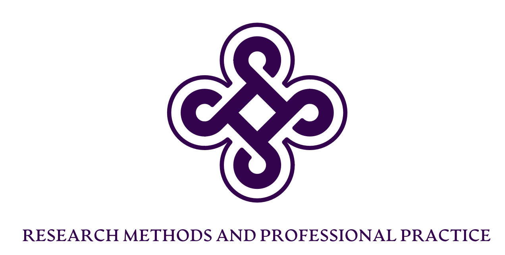

[1](/MyPortfolio/RMPP/Unit01.html) | [2](/MyPortfolio/RMPP/Unit02.html) | [3](/MyPortfolio/RMPP/Unit03.html) | [4](/MyPortfolio/RMPP/Unit04.html) | [5](/MyPortfolio/RMPP/Unit05.html) | [6](/MyPortfolio/RMPP/Unit06.html) | [7](/MyPortfolio/RMPP/Unit07.html) | [8](/MyPortfolio/RMPP/Unit08.html) | [9](/MyPortfolio/RMPP/Unit09.html) | [10](/MyPortfolio/RMPP/Unit10.html) | [11](/MyPortfolio/RMPP/Unit11.html) | [12](/MyPortfolio/RMPP/Unit12.html)

### Week One [una sabbatorum]

New module time and the first one in a while where it won't be a team project so will have to get back into the solo mindset from the Couse plan looks like it is going to be an interesting module but it’s a from the schedule I won’t be able to attend the seminars as the time they are scheduled for means I will be at work which is a pity as its always nice to debate with the other students on the course. But will watch the videos to engage with the module content.

## Forum Post

The ACM Code of Ethics and the BCS code of conduct provide two measurable standards for IT Professionals and people who work in the Information Technology Field. It’s been a few years but I believe I’m still actually member of the BCS. The BCS code of ethics is designed to promote the ethical behaviour of members and organisation in the area of computing in which they work. or to Quote Supreme Court Justice Potter Stewart "Ethics is knowing the difference between what you have a right to do and what is right to do." (Huber Stefan security-ligue.org 2018)

The case study I chose to look at for this posting is the Dark UX patterns one (https://ethics.acm.org/code-of-ethics/using-the-code/case-dark-ux-patterns/)

Quite an interesting case, the case study shows a scenario where a company with less than pure motives requested Dark UX changes to their sales website in order to manipulate users via the users Human Computer Interaction (HCI) experience of the site. This change was designed to drive revenue sales by confusing users into making purchases they did not intend by the use of UX elements. The case study informs us that the IT developer who committed the requested changes to the Site UX code later discovered company directors celebrating increased sales due to this design change.

As someone who in the past has worked in a professional context with visually impaired and autistic users in order to provide public services that can be accessed by all members of society and that sites follow WCAG guidance. Under the BCS code of conduct this case study is a good example of what can happen when things go wrong IT developers and organisations rather than being a force for good and working in the interests of customers and users by the inclusion of these design elements hope to exploit for financial gain and increased revenues actually cause harm to the users being served by the service.

On the discovery of this information there are a number of actions the developer could and should take. While the first instinct would be to revert the change this opens the user up for potential disciplinary action The first thing that should be done is to follow the established company reporting and grievance process. This differs by company but should involve reporting any concerns up the chain of command If however, the response from this was unsatisfactory then as a UK company under UK law whistle blowers are protected. If the whistle blowing covers the following areas

a criminal offence, for example fraud
someone’s health and safety are in danger
risk or actual damage to the environment
a miscarriage of justice
the company is breaking the law
you believe someone is covering up wrongdoing
Gov.uk (n.d)

If because of whistle blowing the developer was sacked from the company The Public Interest Disclosure Act 1998). provides the right for a worker to take a case to an employment tribunal if they have been victimised at work or they have lost their job because they have 'blown the whistle'. (DBIS 2015)

As an IT professional this would also fall under the code of conduct of the BCS as a member one of the guiding principles of which is the following statement

“Members are expected to exercise their own judgement  to meet the requirements of the code and seek advice if in doubt.” In this case it  would appear to be in breach of sections 1C and 1D of the code of conduct

“conduct your professional activities without discrimination on the grounds of sex, sexual orientation, marital status, nationality, colour, race, ethnic origin, religion, age or disability, or of any other condition or requirement.”
“promote equal access to the benefits of IT and seek to promote the inclusion of all sectors in society wherever opportunities arise.” BCS Code of Conduct. (n.d.).
If however the company was not UK based then the UK protections may not apply though if the company was based in the EU then it would be covered under Directive (EU) 2019/1937 that allows for

anonymous reporting if this is allowed under national legislation;
protects the identity of the reporter and parties mentioned in a report;
is not accessible for non-authorised staff members
provides for diligent follow-up on the report by a designated person or department. (klapwijk Laura 2019)
other legislation covering whistle blowing may exist in other jurisdictions the worker however as a member of the BCS means the code of conduct would apply even if working for an international company outside of whistle blowing legislation.

References

BCS Code of Conduct. (n.d.). British Computer Society. https://www.bcs.org/membership-and-registrations/become-a-member/bcs-code-of-conduct/

Department of Business innovation and Skills (https://assets.publishing.service.gov.uk/government/uploads/system/uploads/attachment_data/file/415175/bis-15-200-whistleblowing-guidance-for-employers-and-code-of-practice.pdf) 2015

Public Interest Disclosure Act 1998  https://www.legislation.gov.uk/ukpga/1998/23/contents 02.07.1998

Directive (EU) 2019/1937

https://eur-lex.europa.eu/legal-content/EN/TXT/?uri=CELEX:32019L1937

The EU Whistleblower Directive; what does it mean for you? (klapwijk Laura 2019)

https://www2.deloitte.com/nl/nl/pages/finance/articles/the-eu-whistleblower-directive-what-does-it-mean-for-you.html

Huber Stefan security-ligue.org 2018
https://www.security-ligue.org/news?tx_news_pi1%5Baction%5D=detail&tx_news_pi1%5Bcontroller%5D=News&tx_news_pi1%5Bnews%5D=27&cHash=ecabb2c67c34f77f32e04be82077f5ee#:~:text=%22Ethics%20is%20knowing%20the%20difference,by%20examples%20of%20their%20own.

Whistleblowing for employees (gov.uk n.d)

https://www.gov.uk/whistleblowing

A Good start and looking forward to the rest of the content 

**Weekly Skills Matrix New Knowledge Gained**

- [x] Ethics Refresher
- [x] Indvidual Working

**Happiness Level**
😀😀😀😀😀
