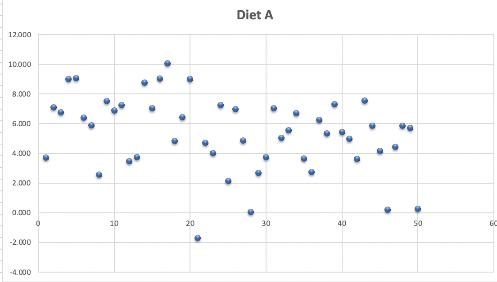
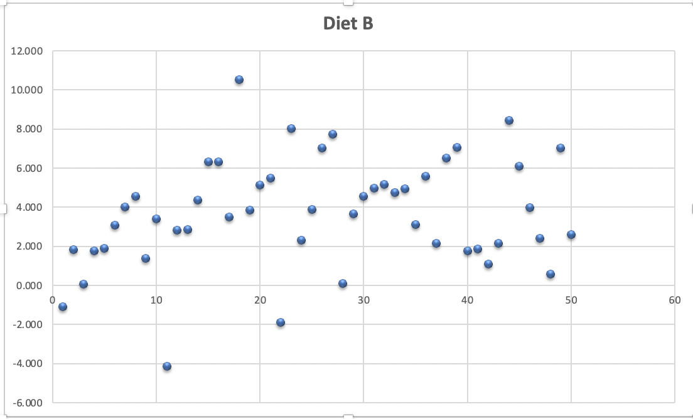
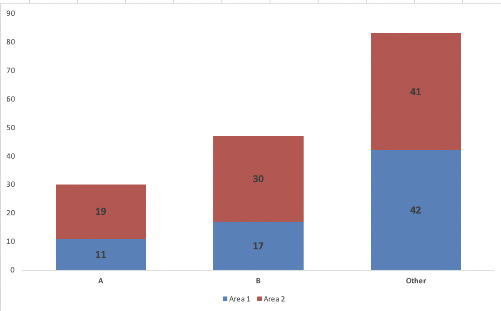
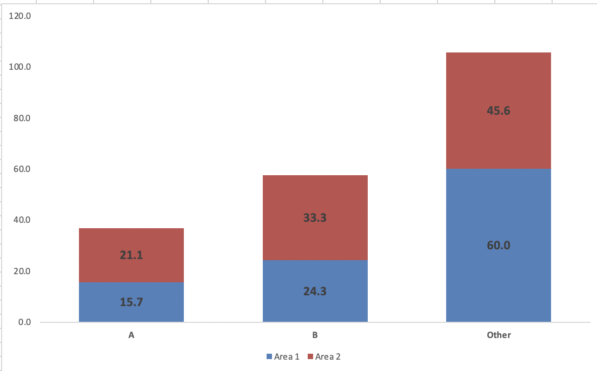

[1](/MyPortfolio/RMPP/Unit01.html) | [2](/MyPortfolio/RMPP/Unit02.html) | [3](/MyPortfolio/RMPP/Unit03.html) | [4](/MyPortfolio/RMPP/Unit04.html) | [5](/MyPortfolio/RMPP/Unit05.html) | [6](/MyPortfolio/RMPP/Unit06.html) | [7](/MyPortfolio/RMPP/Unit07.html) | [8](/MyPortfolio/RMPP/Unit08.html) | [9](/MyPortfolio/RMPP/Unit09.html) | [10](/MyPortfolio/RMPP/Unit10.html) | [11](/MyPortfolio/RMPP/Unit11.html) | [12](/MyPortfolio/RMPP/Unit12.html)

### Week Eight [Hebdomada Octo]

New week new module this week we are looking at  Sample Mean and Sample Standard Deviation 

## Sample Mean

This is defined as "The sample mean (or "empirical mean") and the sample covariance are statistics computed from a sample of data on one or more random variables. The sample mean is the average value (or mean value) of a sample of numbers taken from a larger population of numbers," (Wikipedia 2022 Accessed from https://en.wikipedia.org/wiki/Sample_mean_and_covariance)

This can be caculated by the formula

n = sum of data items / number of data items

| Value  |
|---|
| 1  |
| 2  |
| 6  |
| 9  |

For the example above the calculation would be 18/4 resulting in a sample mean of 4.5

```python
DATA = [1, 2, 6, 9]
print(sum(DATA)/len(DATA))
```


# Excerise 1

| Diet   | Weight Loss  |
|---|---|
| A | 3.709 |
| A | 7.087 |
| A | 6.754 |
| A | 8.994 |
| A | 9.077 |
| A | 6.413 |
| A | 5.877 |
| A | 2.572 |
| A | 7.52 |
| A | 6.881 |
| A | 7.265 |
| A | 3.477 |
| A | 3.755 |
| A | 8.76 |
| A | 7.032 |
| A | 9.052 |
| A | 10.062 |
| A | 4.84 |
| A | 6.449 |
| A | 9.019 |
| A | -1.715 |
| A | 4.718 |
| A | 4.007 |
| A | 7.241 |
| A | 2.128 |
| A | 6.968 |
| A | 4.853 |
| A | 0.055 |
| A | 2.68 |
| A | 3.746 |
| A | 7.033 |
| A | 5.033 |
| A | 5.569 |
| A | 6.712 |
| A | 3.663 |
| A | 2.741 |
| A | 6.256 |
| A | 5.349 |
| A | 7.3 |
| A | 5.445 |
| A | 4.97 |
| A | 3.613 |
| A | 7.568 |
| A | 5.861 |
| A | 4.157 |
| A | 0.203 |
| A | 4.441 |
| A | 5.875 |
| A | 5.715 |
| A | 0.28 |
| B | -1.087 |
| B | 1.819 |
| B | 0.074 |
| B | 1.755 |
| B | 1.889 |
| B | 3.089 |
| B | 4.008 |
| B | 4.551 |
| B | 1.372 |
| B | 3.413 |
| B | -4.148 |
| B | 2.823 |
| B | 2.865 |
| B | 4.369 |
| B | 6.337 |
| B | 6.308 |
| B | 3.494 |
| B | 10.539 |
| B | 3.84 |
| B | 5.123 |
| B | 5.485 |
| B | -1.894 |
| B | 8.016 |
| B | 2.31 |
| B | 3.882 |
| B | 7.03 |
| B | 7.727 |
| B | 0.105 |
| B | 3.65 |
| B | 4.547 |
| B | 4.985 |
| B | 5.159 |
| B | 4.76 |
| B | 4.934 |
| B | 3.106 |
| B | 5.598 |
| B | 2.162 |
| B | 6.52 |
| B | 7.046 |
| B | 1.757 |
| B | 1.848 |
| B | 1.096 |
| B | 2.145 |
| B | 8.435 |
| B | 6.099 |
| B | 3.972 |
| B | 2.409 |
| B | 0.569 |
| B | 7.013 |
| B | 2.594 |

**Diet A**



| Type  | Value   |
|---|---|
| Number  | 50   |
| Mean  | 5.341  |
| SD    | 2.536  |


**Diet B**



| Type  | Value   |
|---|---|
| Number  | 50   |
| Mean  | 3.710  |
| SD    | 2.769  |


### 8.1 

[Exe 8.1B.xlsx](/MyPortfolio/RMPP/Exe%208.1B.xlsx)

Open the Excel workbook in Exe 8.1B.xlsx from the Exercises folder. Obtain the sample size, sample mean weight loss and the sample standard deviation of the weight loss for Diet B. Place these results in the block of cells F23 to F25, using the same format as that employed for the Diet A results in the above example.

Briefly interpret your findings. What do these results tell you about the relative effectiveness of the two weight-reducing diets?

What the data tells us about the two diets is that the mean weightloss for Diet A is 5.341, and the mean weightloss for Diet B is 3.710. From the supplied data this indicates that those subjects on Diet A  have a greater weight reduction than those on Diet B. The standard deviation  of Diet B is greater than the standard deviation of Diet A. This indicates that Diet A has less deviation than that of Diet B, and from this we can conclude that the results for diet A's data are more valid.

### 8.2

[Exe 8.2B.xlsx](/MyPortfolio/RMPP/Exe%208.2B.xlsx)

Open the Excel workbook in Exe 8.2B.xlsx from the Exercises folder. Obtain the sample median, first and third quartiles and the sample interquartile range of the weight loss for Diet B. Place these results in the block of cells F26 to F29, using the same format as that employed for the Diet A results in the above example.

Briefly interpret your findings. What do these results tell you about the relative effectiveness of the two weight-reducing diets?

**Diet A**

| Type  | Value   |
|---|---|
| Number  | 50   |
| Mean  | 5.341  |
| SD    | 2.536  |
| Median | 5.642 |
| Q1     | 3.748 |
| Q3     | 7.033 |
| IQR    | 3.285 |

**Diet B**

| Type  | Value   |
|---|---|
| Number  | 50   |
| Mean  | 3.710  |
| SD    | 2.769  |
| Median | 3.745 |
| Q1     | 1.953 |
| Q3     | 5.404 |
| IQR    | 3.451 |

From the data provided the median weight reduction for Diet B is 3745 grammes (8.256 lbs) from this we can say the diet has met it goals of reducing weight. in comparison the median weight reduction for Diet A is 5642 grammes (12.438 lbs) so we can also say diet A has met the goals of reducing weight based on the mean values we can say that the mean weight loss for Diet A subjects is 50.654% more then Diet B we can see when we look at the Q1 and Q3 values a 91% difference on the Q1 Value and 30.144% difference on the Q3 Values indicating the bigger difference between two datasets is in the Q1 data. if we look at the IQR values of the two datasets this shows only a 5.053% difference between the two datasets but we can say that from the two sets of data more subjects lost weight on diet plan A (49) then on Plan B (47) 

## 8.3


[Exe 8.3D.xlsx](/MyPortfolio/RMPP/Exe%208.3D.xlsx)

Open the Excel workbook in Exe 8.3D.xlsx from the Exercises folder. Obtain the frequencies and percentage frequencies of the variable Brand, but this time for the Area 2 respondents, using the same format as that employed for the Area1 results in the above example.

Briefly interpret your findings. What do these results tell you about the patterns of brand preferences for each of the two demographic areas?

| Area   | Brand  |
|---|---|
| 1 | B |
| 1 | Other |
| 1 | A |
| 1 | B |
| 1 | Other |
| 1 | A |
| 1 | Other |
| 1 | Other |
| 1 | Other |
| 1 | Other |
| 1 | B |
| 1 | Other |
| 1 | Other |
| 1 | A |
| 1 | A |
| 1 | A |
| 1 | B |
| 1 | A |
| 1 | Other |
| 1 | B |
| 1 | A |
| 1 | B |
| 1 | Other |
| 1 | Other |
| 1 | B |
| 1 | B |
| 1 | Other |
| 1 | Other |
| 1 | Other |
| 1 | Other |
| 1 | Other |
| 1 | B |
| 1 | B |
| 1 | Other |
| 1 | Other |
| 1 | B |
| 1 | B |
| 1 | B |
| 1 | Other |
| 1 | Other |
| 1 | B |
| 1 | Other |
| 1 | Other |
| 1 | Other |
| 1 | Other |
| 1 | Other |
| 1 | Other |
| 1 | Other |
| 1 | Other |
| 1 | Other |
| 1 | A |
| 1 | Other |
| 1 | A |
| 1 | Other |
| 1 | Other |
| 1 | Other |
| 1 | A |
| 1 | A |
| 1 | Other |
| 1 | Other |
| 1 | Other |
| 1 | Other |
| 1 | Other |
| 1 | Other |
| 1 | B |
| 1 | Other |
| 1 | B |
| 1 | Other |
| 1 | Other |
| 1 | B |
| 2 | A |
| 2 | B |
| 2 | A |
| 2 | Other |
| 2 | A |
| 2 | B |
| 2 | Other |
| 2 | Other |
| 2 | B |
| 2 | B |
| 2 | Other |
| 2 | B |
| 2 | B |
| 2 | Other |
| 2 | Other |
| 2 | A |
| 2 | B |
| 2 | A |
| 2 | Other |
| 2 | B |
| 2 | Other |
| 2 | Other |
| 2 | A |
| 2 | Other |
| 2 | A |
| 2 | B |
| 2 | Other |
| 2 | B |
| 2 | Other |
| 2 | B |
| 2 | Other |
| 2 | B |
| 2 | Other |
| 2 | B |
| 2 | A |
| 2 | A |
| 2 | Other |
| 2 | B |
| 2 | Other |
| 2 | Other |
| 2 | A |
| 2 | B |
| 2 | B |
| 2 | Other |
| 2 | Other |
| 2 | Other |
| 2 | Other |
| 2 | B |
| 2 | B |
| 2 | B |
| 2 | Other |
| 2 | Other |
| 2 | B |
| 2 | B |
| 2 | A |
| 2 | Other |
| 2 | B |
| 2 | A |
| 2 | A |
| 2 | B |
| 2 | Other |
| 2 | Other |
| 2 | Other |
| 2 | B |
| 2 | Other |
| 2 | Other |
| 2 | A |
| 2 | Other |
| 2 | A |
| 2 | B |
| 2 | B |
| 2 | Other |
| 2 | Other |
| 2 | B |
| 2 | Other |
| 2 | A |
| 2 | Other |
| 2 | A |
| 2 | Other |
| 2 | Other |
| 2 | Other |
| 2 | Other |
| 2 | Other |
| 2 | A |
| 2 | B |
| 2 | A |
| 2 | B |
| 2 | B |
| 2 | Other |
| 2 | Other |

**Frequency**

|   | Area 1  | Area 2   | 
|---|---|---|
| A      | 11  |  19 |   
| B      | 17  | 30  |   
| Other  | 42  |  41 |   
| Total  | 70  | 90  |   



**Percentages**

|   | Area 1  | Area 2   | 
|---|---|---|
| A      | 15.7  |  21.1 |   
| B      | 24.3  | 33.3  |   
| Other  | 60.0  | 45.6  |   
| Total  | 100.00  | 100.00  |   



From the data we can see people prefer "Other" brands rather then brand A or brand B (Area 1: 60%, Area 2: 45.6%) of the two named brands (A,B) Brand B is the most popular in the two regions Brand A Area 1 (11 15.7%) Area 2 (19 21.1%) Brand B Area 1 (17 24.3%) Area 2 (30 33.3%) Brand A is the lowest scoring brand in both Areas with 15.7% in Area A and 21.1% in Area B.

### 8.4

Consider the filtration data of Data Set G. Open the Excel workbook Exe8.4G.xlsx which contains these data from the Exercises folder.

Assuming the data to be suitably distributed, complete a two-tailed test of whether the population mean impurity differs between the two filtration agents, and interpret your findings.

| Batch | Agent 1  | Agent 2 |
|---|---|---|
| 1 |7.7 |8.5 |
| 2 |9.2 |9.6 |
| 3 |6.8 |6.4 |
| 4 |9.5 |9.8 |
| 5 |8.7 |9.3 |
| 6 |6.9 |7.6 |
| 7 |7.5 |8.2 |
| 8 |7.1 |7.7 |
| 9 |8.7 |9.4 |
| 10 |9.4 |8.9 |
| 11 |9.4 |9.7 |
| 12 |8.1 |9.1 |
														

**Weekly Skills Matrix New Knowledge Gained**

- [x] Refresher on Python DataTypes
- [x] Infrastructure Build Out

**Happiness Level**
😀😀😀😀😀
