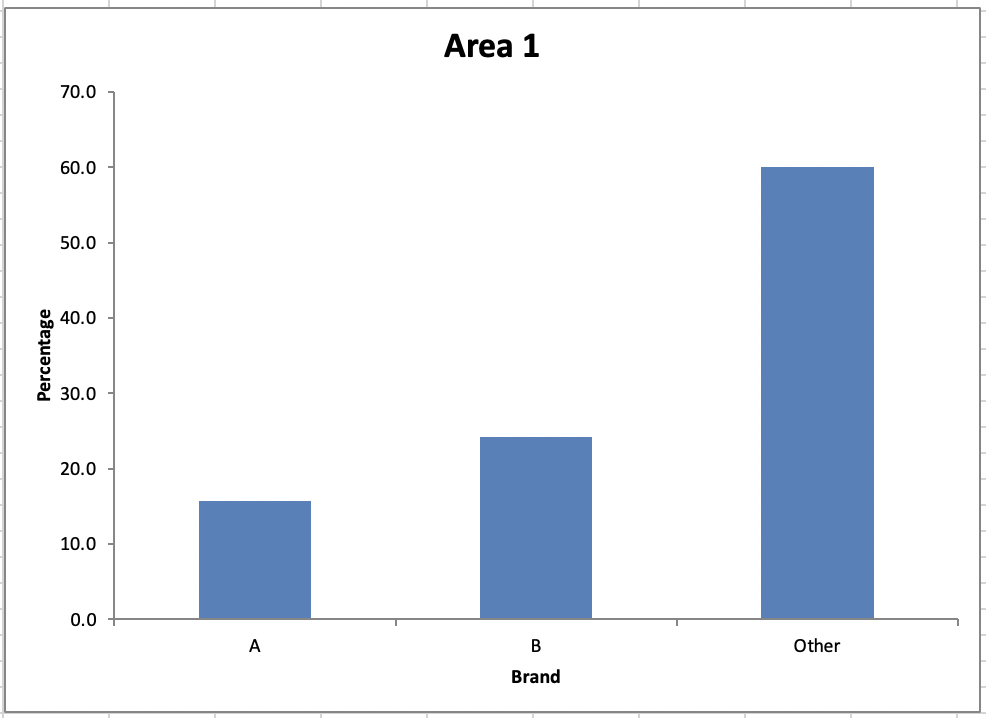
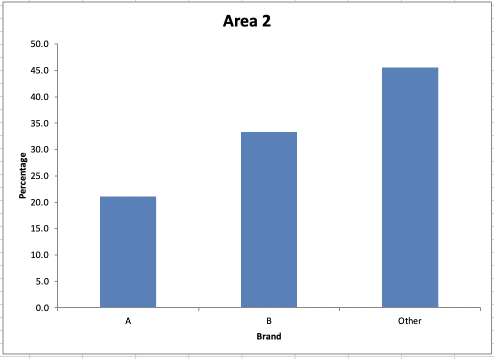

[1](/MyPortfolio/RMPP/Unit01.html) | [2](/MyPortfolio/RMPP/Unit02.html) | [3](/MyPortfolio/RMPP/Unit03.html) | [4](/MyPortfolio/RMPP/Unit04.html) | [5](/MyPortfolio/RMPP/Unit05.html) | [6](/MyPortfolio/RMPP/Unit06.html) | [7](/MyPortfolio/RMPP/Unit07.html) | [8](/MyPortfolio/RMPP/Unit08.html) | [9](/MyPortfolio/RMPP/Unit09.html) | [10](/MyPortfolio/RMPP/Unit10.html) | [11](/MyPortfolio/RMPP/Unit11.html) | [12](/MyPortfolio/RMPP/Unit12.html)

### Week Nine [Hebdomada Novem]

A New week this week is all about In this unit, we focused on visually representing data something I have some experience of having been involved in BI for a number of years so this hopfully may pick up some tips and tricks that I can also use in my day to day role. So going to spend some time this week reviewing content and doing the execerises.

### Excerises

### 9.1

[Exe 9.1D.xlsx](/MyPortfolio/RMPP/Exe9.1D.xlsx)

Open the Excel workbook in Exe 9.1D.xlsx from the Exercises folder. This contains the percentage frequencies together with the bar chart just created in the above example. Add a percentage frequency bar chart showing the brand preferences in Area 2, using the same format as that employed for the Area1 results in the above example. Drag your new chart so that it lies alongside that for Area 1.

Briefly interpret your findings. What do these results tell you about the patterns of brand preferences for each of the two demographic areas?

### Conslusion

From the data we can concude the following Brand A is the least popular in both areas Brand B is the second most popular in both areas through more people pefer it in Area B then Area A and Other is the most popular in both areas.

### 9.2

Open the Excel workbook in Exe 9.2E.xlsx from the Exercises folder. This contains the frequency distributions for Data Set E (see the Data Annexe) to which has been added the corresponding percentage frequency distributions. Complete a percentage frequency clustered column bar chart showing the heather species prevalences in the two different locations.

Briefly interpret your findings

Having now done the excerises This week’s exercises gave me a greater understanding of how to visualise data though still perfer other tooling rather then excel Power BI , Crystal Reports wouldl be my goto tools to visiulaise data but as a ease of access solution excel is not too bad.  

**Weekly Skills Matrix New Knowledge Gained**

- [x] 
- [x] 

**Happiness Level**
😀😀😀
