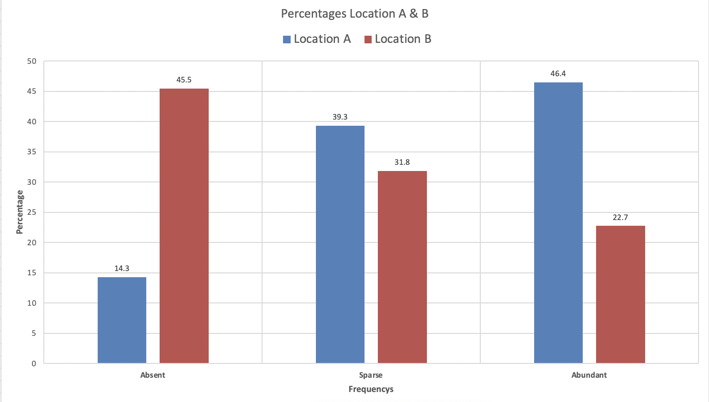

[1](/MyPortfolio/RMPP/Unit01.html) | [2](/MyPortfolio/RMPP/Unit02.html) | [3](/MyPortfolio/RMPP/Unit03.html) | [4](/MyPortfolio/RMPP/Unit04.html) | [5](/MyPortfolio/RMPP/Unit05.html) | [6](/MyPortfolio/RMPP/Unit06.html) | [7](/MyPortfolio/RMPP/Unit07.html) | [8](/MyPortfolio/RMPP/Unit08.html) | [9](/MyPortfolio/RMPP/Unit09.html) | [10](/MyPortfolio/RMPP/Unit10.html) | [11](/MyPortfolio/RMPP/Unit11.html) | [12](/MyPortfolio/RMPP/Unit12.html)

### Week Nine [Hebdomada Novem]

A New week this week is all about in this unit, we focused on visually representing data something I have some experience of having been involved in BI for a number of years so this hopefully may pick up some tips and tricks that I can also use in my day to day role. So going to spend some time this week reviewing content and doing the exercises.

### Exercises

### 9.1

[Exe 9.1D.xlsx](/MyPortfolio/RMPP/Exe9.1D.xlsx)

Open the Excel workbook in Exe 9.1D.xlsx from the Exercises folder. This contains the percentage frequencies together with the bar chart just created in the above example. Add a percentage frequency bar chart showing the brand preferences in Area 2, using the same format as that employed for the Area1 results in the above example. Drag your new chart so that it lies alongside that for Area 1.

Briefly interpret your findings. What do these results tell you about the patterns of brand preferences for each of the two demographic areas?

### Conclusion

From the data we can conclude the following Brand A is the least popular in both areas Brand B is the second most popular in both areas through more people prefer it in Area B then Area A and Other is the most popular in both areas

### 9.2

[Exe 9.2E.xlsx](/MyPortfolio/RMPP/Exe9.2E.xlsx)

Open the Excel workbook in Exe 9.2E.xlsx from the Exercises folder. This contains the frequency distributions for Data Set E (see the Data Annexe) to which has been added the corresponding percentage frequency distributions. Complete a percentage frequency clustered column bar chart showing the heather species prevalences in the two different locations.

Briefly interpret your findings

### Conclusion

From the Histogram we can see that in location A there are less absent frequencies than in Location B we can also see that location B absent frequencies are 31.2 % higher than location A we can also see that Sparse frequency is pretty even across both locations. We can also see that in Location A Abundant 46.4% making up nearly 50% of the total.

### 9.3

[Exe 9.3B.xlsx](/MyPortfolio/RMPP/Exe9.3B.xlsx)

Open the Excel workbook in Exe 9.3B.xlsx from the Exercises folder. This contains the relative frequency histogram for the Diet A weight loss produced in Example 9.3 together with some of the Diet B weight loss summary statistics. Add a relative frequency histogram of the weight loss for Diet B, where possible using the same classes as those employed for the Diet A results in the above example. 

Briefly interpret your histogram. What do these results tell you about the patterns of weight loss for each of the two diets?

### Diet A

### Diet B

### Conclusion

Diet A Appears to offer the people on it better outcomes as more people have lost weight on Diet A then Diet B that being said the number of people who gain weight on Diet B is greater than the number who gain weight on Diet A so from this we can conclude that diet A is superior to Diet B for people who wish to lose weight.

Having now done the exercises This week’s exercises gave me a greater understanding of how to visualise data though still prefer other tooling rather than excel Power BI , Crystal Reports would still be my go to tools to visualise data but as a ease of access solution excel is not too bad. Think these last two weeks have been the most enjoyable so far on this module so let’s finish strong over the next couple of weeks.

**Weekly Skills Matrix New Knowledge Gained**

- [x] Excel Graphics
- [x] Excel Functions some new functions I had never used before 

**Happiness Level**
😀😀😀😀😀
