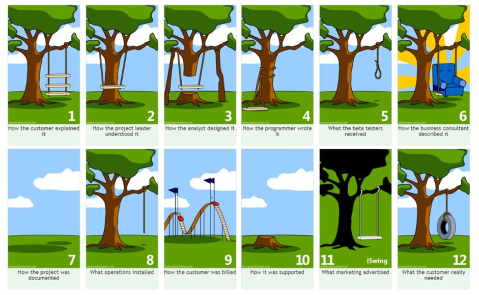

**Question 1: What do you believe are the three most common reasons for project failure?**

“Operations keeps the lights on, strategy provides a light at the end of the tunnel, but project management is the train engine that moves the organization forward.” (Gumz Joy) Projects never fail for a single reason it is always a combination of reasons that cause a chain of event that lead to the failure of a project the British Computing Society define some common causes of project failure as

- Lack of executive support
- Poor strategic alignment
- Poor risk management
- Poor communication
- Poor project management practices
- Delays to decision making

(Harrin Elizabeth, 2018)
That being said there are some trends we can draw on from this list and from personal experience as to why projects fail. The most common are lack of planning in not identifying and defining the full scope of the work and as a result of this what will be involved in order to deliver the desired outcome. Without having a clear view of what needs to be achieved by a piece of work the project will suffer from potential scope creep it also means that progress on a project cannot be easily measured and monitored if the full scope of the work is not fully understood.

Having worked in the UK public sector for a number of years I have first-hand experience of projects failure due to insufficient scoping as this stage is fundamental to the success or failure of a project and its ability to deliver. The Second common reason for failure is failure in communication affective communication is a key factor in the successful delivery of any project the association for project management make the following statement on communication

**Projects are more likely to reap success through strong teamwork and effective communication. For project managers, it’s paramount to have solid communication techniques. Studies by Project Management Institute found lack of communication was classed as the biggest contributor for project failure. (Palmer Kate, 2021)**

The ability to be an effective communicator is a vital skill to have in project delivery as it crosses all stages of a project from project inception, requirements gathering, to final delivery of the project failure to effectively communicate to all stakeholders involved.    

While old Dating from the 1970s the following shows in a nice visual concise way why communication is so important in project delivery and why if you get it wrong it can lead to the failure of a project. so much so that this was once my Microsoft teams background so when talking to my work team they understood how important effective communication is  

(Anon, 2020) A third common reason for project failure is poor resource planning having the right resources at the right time is key to the successful delivery of a project have too many resources and the project budget is stretched have too few and the project will fail to be delivered. It is common knowledge in software development but also in larger civil engineering projects that adding additional people / resources to a project requires taking the current allocated people and resources who are engaged and working on the project out from doing project delivery to bring the new people up to speed on the project. Which results in having the exact opposite effect of what was desired stretching out the time to deliver the project rather then reducing it. Or to Quote the book The mythical man-month 

 **“Adding manpower to a late software project makes it late” (Brooks, 1978)**
 
 Modern project planning tools and techniques have improved resource planning allowing accurate estimates to be made taking away some of the work from people and this is a good thing as humans are not suited to making accurate predictions. This is well described in the paper The planning Fallacy (Kahnerman D & Tversky 1979) (Buehler, Griffin and Ross, 1994) which describes how humans display a bias to optimism when planning and carrying out planning and evaluation of tasks. The interesting thing was this only applied to self-evaluation of tasks when carrying out evaluation of other tasks it goes the other way and people over estimate how long the tasks will take to complete. But poor estimation has been the cause of more than one project failure.
 
 **Question 2: Give two examples of failures that support your choices (there are several examples in the lecture cast).**
 
### Airbus A380

The Airbus A380 was launched in 2007 at the time it was marketed as the world’s largest passenger aircraft but unlike the venerable Boeing 747 that was in production from 1968 to 222 the Airbus A380 Ended production in 2021. The reason for the short production life of the A380 were numerous and can be read about in the following paper

**Dörfler, Isabel & Baumann, Oliver. (2014). Learning from a Drastic Failure: The Case of the Airbus A380 Program. Industry and Innovation. 21. 10.1080/13662716.2014.910891.**

but in the context of communication the project team for the A380 project were split over multiple teams’ multiple languages English, German Spanish, Dutch multiple geographic locations and over 1000 external contractors / companies to manage and coordinate within the Airbus teams each had their own procedures and even different design software packages. This failure of communication of both people and systems contributed to an estimated budget overrun of 6 billion Dollars. This was also a prime example of what can happen when the assumptions of a project change during the implementation of a solution. In this case the market dynamics changed with airlines wanting smaller faster more fuel efficient aircraft.(Bailey Joanna, 2021)  but the project did not adapt to the changing ground truth and produced a product that no longer met the needs of the aircraft buying customers.

### PT Cruiser

An example of where poor project planning was the PT cruiser car which is an example of how you need to plan across the whole spectrum of the project to ensure a successful outcome in this case the major areas of the project such as design advertising and production had been thought off and were successfully implemented as part of the delivery of the new model. The failure came during the final delivery phase of the project. Delivery times from the factory to the dealers had not been suffiently looked or had been under estimated at there had also been a failure to communicate between Chrysler corporate and the dealer network who would be selling the vehicles to the public. As a result of this poor planning dealers did not get the vehicles, they needed at the time they needed resulting in unhappy customers (Anon) and lost sales as customers purchaed vehicles from other dealers.

### References

Bailey Joanna. (2021). The Shift To Small: Long Haul Flights Will Use Smaller Planes. [Online]. Available at: https://simpleflying.com/shift-to-small/ [Accessed 14 June 2022].

Brooks, F. P. (1978). The  Mythical Man-Month: Essays on Softw. 1st ed. USA: Addison-Wesley Longman Publishing Co., Inc.

Buehler, R., Griffin, D. and Ross, M. (1994). Exploring the “Planning Fallacy”: Why People Underestimate Their Task Completion Times. Journal of Personality and Social Psychology, 67 (3).

Gumz Joy. Operations keeps the lights on, strategy provides a light at the end of the tunnel, but project management is the train engine that moves the organization forward. ~ Joy Gumz - PMI Macedonia. [Online]. Available at: https://pmi-macedonia.mk/quotes/operations-keeps-the-lights-on-strategy-provides-a-light-at-the-end-of-the-tunnel-but-project-management-is-the-train-engine-that-moves-the-organization-forward-joy-gumz/ [Accessed 14 June 2022].

Harrin Elizabeth. (2018). Why do some projects fail? (and some succeed?) | BCS. [Online]. Available at: https://www.bcs.org/articles-opinion-and-research/why-do-some-projects-fail-and-some-succeed/ [Accessed 14 June 2022].

Palmer Kate. (2021). Communication techniques for effective project management. [Online]. Available at: https://www.apm.org.uk/blog/communication-techniques-for-effective-project-management/ [Accessed 14 June 2022].

(2020). Project Management - A Tree Swing Story - Agile - ZenTao. [Online]. Available at: https://www.zentao.pm/blog/tree-swing-project-management-tire-analogy-426.mhtml [Accessed 14 June 2022].

Project Scope Creep Explained with Examples – Knowledge Hub for Business Management and Technology Professionals. [Online]. Available at: https://www.projectpractical.com/project-scope-creep/ [Accessed 14 June 2022].
 

