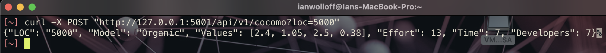

[1](/MyPortfolio/SEPM/Unit01.html) | [2](/MyPortfolio/SEPM/Unit02.html) | [3](/MyPortfolio/SEPM/Unit03.html) | [4](/MyPortfolio/SEPM/Unit04.html) | [5](/MyPortfolio/SEPM/Unit05.html) | [6](/MyPortfolio/SEPM/Unit06.html) | [7](/MyPortfolio/SEPM/Unit07.html) | [8](/MyPortfolio/SEPM/Unit08.html) | [9](/MyPortfolio/SEPM/Unit09.html) | [10](/MyPortfolio/SEPM/Unit10.html) | [11](/MyPortfolio/SEPM/Unit11.html) | [12](/MyPortfolio/SEPM/Unit12.html)


### Week Four [Hebdomada quattuor]

Met with the other team the meeting was less then successful so we will need to rearange the meeting as we are a bit stuck until we get the reqirements spent the time creating a outline of the executive summary that I will share with my team at our next weekly meeting and expanded on the Python app I wrote last week to create a REST API version that can be called by a HTTP request

```python
import json
import sys
from typing import Any, NoReturn

from flask import Flask, request, make_response

app = Flask(__name__)


def basic_cocomo(loc: int) -> list:
    """
    Calculate Based on the COCOMO Method
    :param loc: Lines of Code
    :return: None
    """
    global MODEL
    effort, time_needed, developers = 0, 0, 0
    # Models
    cocomo_models: list[tuple[str, list[float]]] = [("Organic", [2.4, 1.05, 2.5, 0.38]), ("Semi-Detached", [3.0, 1.12, 2.5, 0.35]), ("Embedded", [3.6, 1.20, 2.5, 0.32])]  # noqa: E501

    if isinstance(loc, int):
        lines_of_code: int = loc
    else:
        raise TypeError
    # Set the Model we are using Organic etc based on lines of code
    if 2 <= lines_of_code / 1000 <= 50:
        MODEL = cocomo_models[0]
    elif 50 < lines_of_code / 1000 <= 300:
        MODEL = cocomo_models[1]
    elif 300 > lines_of_code / 1000:
        MODEL = cocomo_models[2]
    try:
        # Actual Calculations used to produce the Final Answers
        # Use ** rather then MODEL[1][0]*Pow(lines_of_code / 0x3E8,MODEL[1][1]) as performance is slighty better
        # as we dont need to make a function call
        effort: float = MODEL[1][0] * (lines_of_code / 0x3E8) ** MODEL[1][1]
        time_needed: float = MODEL[1][2] * (effort ** MODEL[1][3])
        developers: float = effort / time_needed
    except UnboundLocalError:
        print("Input Value Cannot be Processed")

    return [MODEL, effort, time_needed, developers]


@app.route('/api/v1/cocomo', methods=['POST'])
def calculate_cocomo() -> Any:
    lines_of_code = request.args.get('loc', '')
    try:
        coco = basic_cocomo(int(lines_of_code))
        coco_json = json.dumps({"LOC": lines_of_code, "Model": coco[0][0], "Values": coco[0][1], "Effort": round(coco[1]), "Time": round(coco[2]), "Developers": round(coco[2])})
        api_response = make_response(coco_json, 200)
        api_response.headers["api_version"] = '1.0'
        api_response.headers["Content-Type"] = "application/json"
        return make_response(coco_json, 200)
    except ValueError:
        return make_response({"Error": "Invalid or Missing Parameter"})


if sys.version_info > (2, 7):
    if __name__ == '__main__':
        app.run(port=5001, host='0.0.0.0', debug=True, use_reloader=False, threaded=True)
else:
    print("OutDated Python Version")

```



Personally being a person who like to have things done well in advance and have a laid out plan to execute not personally thrilled by the delays that have been introduced as these will ripple through the rest of the project. It means we have lost at least a week of development time and that is not something that is wanted as it means we will need to redo estimates on timelines and the scope of what can be achieved. While delays happen in any project this one is quite anoying as it was 100% preventable. That being said and to take a saying from the Miltary "Adapt and overcome" and that is what we as a team will need to do we will amend our plan and overcome this setback. It just proves no matter how good your project plan once you actually get to implenetation things have a tendency to get in the way of delivering a 100% aligned with the plan project. 

**Weekly Skills Matrix New Knowledge Gained**

- [x] 
- [x] 

**Happiness Level**
😀😀😀😀😀
