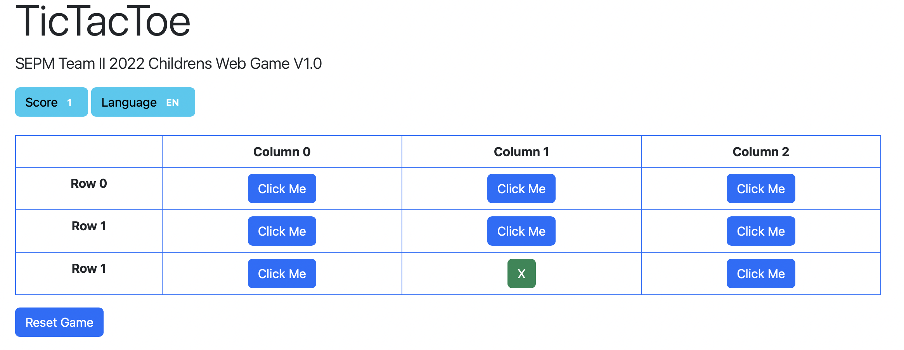
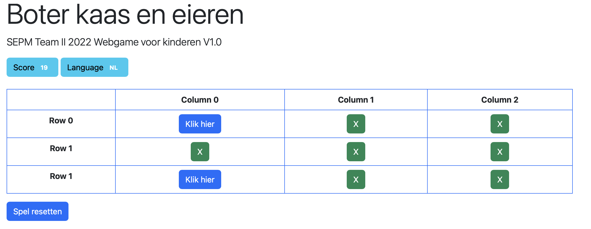
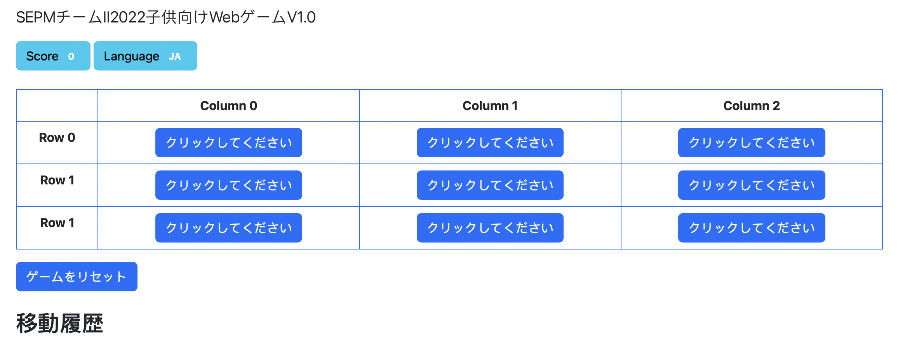

[1](/MyPortfolio/SEPM/Unit01.html) | [2](/MyPortfolio/SEPM/Unit02.html) | [3](/MyPortfolio/SEPM/Unit03.html) | [4](/MyPortfolio/SEPM/Unit04.html) | [5](/MyPortfolio/SEPM/Unit05.html) | [6](/MyPortfolio/SEPM/Unit06.html) | [7](/MyPortfolio/SEPM/Unit07.html) | [8](/MyPortfolio/SEPM/Unit08.html) | [9](/MyPortfolio/SEPM/Unit09.html) | [10](/MyPortfolio/SEPM/Unit10.html) | [11](/MyPortfolio/SEPM/Unit11.html) | [12](/MyPortfolio/SEPM/Unit12.html)

### Week Five [Hebdomada Quinque]

Another Busy Week from our team meeting we are now at the point where we can start the actual development phase of the project we decided to split the deveopment into two section the actual game which we are thinking will be a web version of either the classic tictactoe or hangman games and the profile and user services part. I will be picking up the game development part of the development phase so will need to find someone to pick up the project management role as I will need to be more focused on the devepment role in the next few weeks.

While in general the project is going well do have some concerns over the missalignment of tasks and the skillsets required to complete those tasks so may need to raise that at out next meeting. looking forward to next week I want to get a framework in place for the game but also want to start looking at the presentation we need to do for part two. I finsihed writing the Exective summary this week and have passed it it the rest of the team for comments and for any polishing that is required. 

Also this week started putting together some outlines of the design of the game currenty thinking of doing a variation of the classic tic tac toe game but did manage to write the code to implement dyanmic translation that I will present to the rest of the team at our next team meeting.  

Bit anoyed that we are not as far forward as I would like in the project phase but will regroup with the team and adjust the plan so that we can get everthing we need done in the time we have. Big focus for the next week however will be on fine tuning the first submission paper before the submission date. 

**Weekly Skills Matrix New Knowledge Gained**

- [x] Google Translate APIs
- [x] Flask refresher 

**Happiness Level**
😀😀😀😀😀
