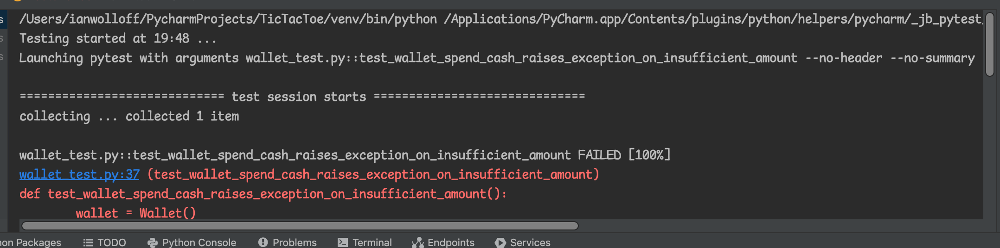

[1](/MyPortfolio/SEPM/Unit01.html) | [2](/MyPortfolio/SEPM/Unit02.html) | [3](/MyPortfolio/SEPM/Unit03.html) | [4](/MyPortfolio/SEPM/Unit04.html) | [5](/MyPortfolio/SEPM/Unit05.html) | [6](/MyPortfolio/SEPM/Unit06.html) | [7](/MyPortfolio/SEPM/Unit07.html) | [8](/MyPortfolio/SEPM/Unit08.html) | [9](/MyPortfolio/SEPM/Unit09.html) | [10](/MyPortfolio/SEPM/Unit10.html) | [11](/MyPortfolio/SEPM/Unit11.html) | [12](/MyPortfolio/SEPM/Unit12.html)


### Week Six [Hebdomada Sex]

Spent a couple of hours looking at pytest its a lot nicer then unittest so may use this in all my projects now part of the excerise was to take some unit tests and make them fail. Must admit never been asked before to make a test fail first thought was ok look at the edge cases as we are dealing with money I thought lets look at what happens if we introduce a negtive number for this I added to the main class so we could capture an exception in regard to negitive numbers 

```python
"""
New Type to raise Exception on Negitive Values
"""

class ValueLessThenZero(Exception):
    pass
```

The first test was simple get the wallet amount and ensure it was zero the default value

```python
def test_default_initial_amount():
    wallet = Wallet()
    assert wallet.balance == 0
```

We can make this fail by overiding the __init__ constructor initial_amoun parameter by passing in a value to the constructor

```python
def test_default_initial_amount(20):
    wallet = Wallet()
    assert wallet.balance == 0
```

In this example we have passed in 20 to the constructor so in the class self.balance will now evaluate to 20 rather then 0 meaning the assertion that the balance is zero will now fail.

The second test sets the value to 100 and then checks that the value returned is 100

```python
def test_setting_initial_amount():
    wallet = Wallet(100)
    assert wallet.balance == 100
```

we can make this test fail by passing in any value that is not 100 for example

```python
def test_setting_initial_amount():
    wallet = Wallet(50)
    assert wallet.balance == 100
```
    
the 3rd test builds a wallet with a value of 10 and then calls the add_cash method to add 90 to it the assert then checks that the value is 100 90+10

```python
def test_wallet_add_cash():
    wallet = Wallet(10)
    wallet.add_cash(90)
    assert wallet.balance == 100
```

as in the previous example we can fail the test by changing either the constructor value or the method call so that the result does not eaqual 100 or by chnaging the sign of the add cash value to negitive -90 as the function does not do any input validation to ensure that the add cash parameter is not a negitive number

```python

    def add_cash(self, amount):
        self.balance += amount
```

we can rewrite this to add validation

```python
    def add_cash(self, amount):
        if amount >= 0:
            self.balance += amount
        else:
            raise ValueLessThenZero
```

For the next test we can again change any of the two values in this case we have set the wallet amount to 30 so when 10 is removed the value left is not 10 so the test will fail

```python
def test_wallet_spend_cash():
    wallet = Wallet(30)
    wallet.spend_cash(10)
    assert wallet.balance == 10
```

in the final test if 

```python
def test_wallet_spend_cash_raises_exception_on_insufficient_amount():
    wallet = Wallet()
    with pytest.raises(InsufficientAmount):
        wallet.spend_cash(100)
```

if we remove the exception catch block the test will then fail

```python 
def test_wallet_spend_cash_raises_exception_on_insufficient_amount():
    wallet = Wallet()
    wallet.spend_cash(100)
```



**Weekly Skills Matrix New Knowledge Gained**

- [x] 
- [x] 

**Happiness Level**
😀😀😀😀😀
