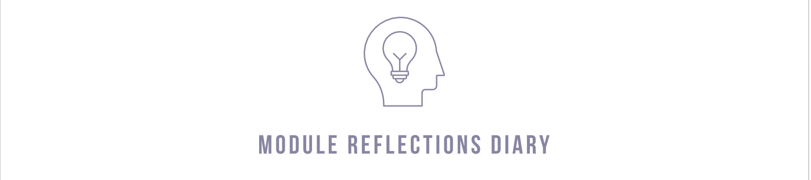

[1](/MyPortfolio/SEPM/Unit01.html) | [2](/MyPortfolio/SEPM/Unit02.html) | [3](/MyPortfolio/SEPM/Unit03.html) | [4](/MyPortfolio/SEPM/Unit04.html) | [5](/MyPortfolio/SEPM/Unit05.html) | [6](/MyPortfolio/SEPM/Unit06.html) | [7](/MyPortfolio/SEPM/Unit07.html) | [8](/MyPortfolio/SEPM/Unit08.html) | [9](/MyPortfolio/SEPM/Unit09.html) | [10](/MyPortfolio/SEPM/Unit10.html) | [11](/MyPortfolio/SEPM/Unit11.html) | [12](/MyPortfolio/SEPM/Unit12.html)


### Week Six [Hebdomada Sex]

Spent a couple of hours looking at pytest its a lot nicer then unittest so may use this in all my projects now part of the excerise was to take some unit tests and make them fail. Must admit never been asked before to make a test fail first thought was ok look at the edge cases as we are dealing with money I thought lets look at what happens if we introduce a negtive number for this I added to the main class so we could capture an exception in regard to negitive numbers 

```python
"""
New Type to raise Exception on Negitive Values
"""

class ValueLessThenZero(Exception):
    pass
```

The first test was simple get the wallet amount and ensure it was zero the default value

```python
def test_default_initial_amount():
    wallet = Wallet()
    assert wallet.balance == 0
```

We can make this fail by overiding the __init__ constructor initial_amoun parameter by passing in a value to the constructor

```python
def test_default_initial_amount(20):
    wallet = Wallet()
    assert wallet.balance == 0
```

In this example we have passed in 20 to the constructor so in the class self.balance will now evaluate to 20 rather then 0 meaning the assertion that the balance is zero will now fail.

**Weekly Skills Matrix New Knowledge Gained**

- [x] 
- [x] 

**Happiness Level**
😀😀😀😀😀
