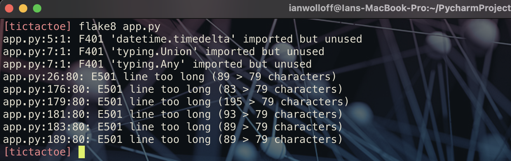

[1](/MyPortfolio/SEPM/Unit01.html) | [2](/MyPortfolio/SEPM/Unit02.html) | [3](/MyPortfolio/SEPM/Unit03.html) | [4](/MyPortfolio/SEPM/Unit04.html) | [5](/MyPortfolio/SEPM/Unit05.html) | [6](/MyPortfolio/SEPM/Unit06.html) | [7](/MyPortfolio/SEPM/Unit07.html) | [8](/MyPortfolio/SEPM/Unit08.html) | [9](/MyPortfolio/SEPM/Unit09.html) | [10](/MyPortfolio/SEPM/Unit10.html) | [11](/MyPortfolio/SEPM/Unit11.html) | [12](/MyPortfolio/SEPM/Unit12.html)

### Week Ten [Hebdomada Decem]

During unit 10, I continued the work into code quality and how to write high quality maintaenable code along with this to try and get a better understanding of how these linters work and the decsions they make spent a good amount of time reading the official PEP8 python style guide Guido van Rossum,Barry Warsaw, Nick Coghlan https://pep8.readthedocs.io/en/release-1.7.x/ while I personally dont agree with eveything contained in the guide max line lenght of 79 characters being a particualr bugbear https://peps.python.org/pep-0008/#maximum-line-length having a style guide is an important factor as it allows us to have as far as possible a common framework on how to write well structured code in a style that another deveoper could pick up the code and understand what is contained and how to add to the codebase. This is important because when we look at commercial code development a majority of the work a developer will do involves additions or maitenance to existing codebases rather then virgin deveopment of new applications and solutions.

**Python Linters** 

The Two main Linters in use in the python ecosystem are Pylint and PyFlakes (Previously Flake8) we can also include other code analysis tools such as bandit and sonarqube. The output of the two main linters are shown below

**Pylint**

**Flake8**

After running pylint and flake8 numerous times, I worked through the error messages attempting to resolve the issues that had been hihjlighted this was a time consuming task made more difficult by pylints rather preechy inteerperation of the styleguide which why Flake8 was my pefered linter it was however a worthwhile excerise as the resulting code was more robust and more closly aligned with the Python style guide. I also fond that both these tools have docker images so might have to look at adding these to our github action pipeline along with the docker build portition. 

Project is still progressing we need to submit the presentation next week so one more big push to get it delivered have asked the team if they can record the transcripts for the parts of the system they did. With me doing the fill in the blanks. so once that is done I will see if I can get a day off work to put the presntation together before passing it to the rest of the team for final review and signoff.

**References**

PEP8 StyleGuide Available at: https://pep8.readthedocs.io/en/release-1.7.x/ (Accessed: 21 July 2022)

HitchHikers Guide to Python Available at https://docs.python-guide.org/writing/style/ (Accessed: 23 July 2022)

Flake8 https://flake8.pycqa.org/en/latest/(Accessed: 21 July 2022)

PEP 8 — the Style Guide for Python Code Available at  https://pep8.org (Accessed: 23 July 2022)

**Weekly Skills Matrix New Knowledge Gained**

- [x] Python Linters
- [x] Python StyleGuide

**Happiness Level**
😀😀😀😀😀
