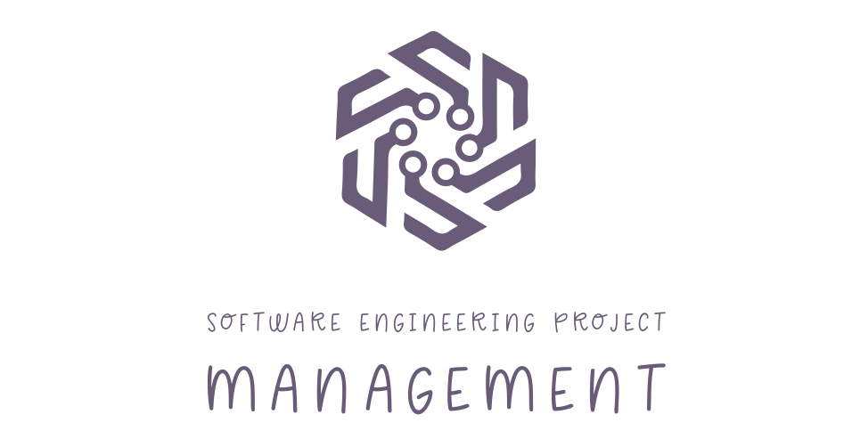

[1](/MyPortfolio/SEPM/Unit01.html) | [2](/MyPortfolio/SEPM/Unit02.html) | [3](/MyPortfolio/SEPM/Unit03.html) | [4](/MyPortfolio/SEPM/Unit04.html) | [5](/MyPortfolio/SEPM/Unit05.html) | [6](/MyPortfolio/SEPM/Unit06.html) | [7](/MyPortfolio/SEPM/Unit07.html) | [8](/MyPortfolio/SEPM/Unit08.html) | [9](/MyPortfolio/SEPM/Unit09.html) | [10](/MyPortfolio/SEPM/Unit10.html) | [11](/MyPortfolio/SEPM/Unit11.html) | [12](/MyPortfolio/SEPM/Unit12.html)

### Week Eleven [Hebdomada undecim]

Submission week so alot of the week has been spent 

Looking now to the project report, I am happy thatwe had achieved most of the requirements agreed upon with the client. Was it perfect no there were still some rough edges but one thing I have learnt from working in IT development is a solution is never done you just stop working on it there are always things you can improve. One area where I am happy was the module gave me expereince of leading a project and also the foundations of how to successfully deviver a project. Being a 100% remote though post covid that is not as different as it use to be and working with a international team in some ways the project was more challenging then a typical project I would work on and because of this I think I am now a more confident person when it comes to project management there is a saying the bristish army have

**Train Hard Fight Easy

And that is a good summary of the module it has given skills that we can use in the real world will I ever manage a international team developing a childs to again I would say unlikely but when I do manage projects I will take some of the skills and lessons gained during the childs toy process into those projects.

**Weekly Skills Matrix New Knowledge Gained**

- [x] 
- [x] 

**Happiness Level**
😀😀😀😀😀
