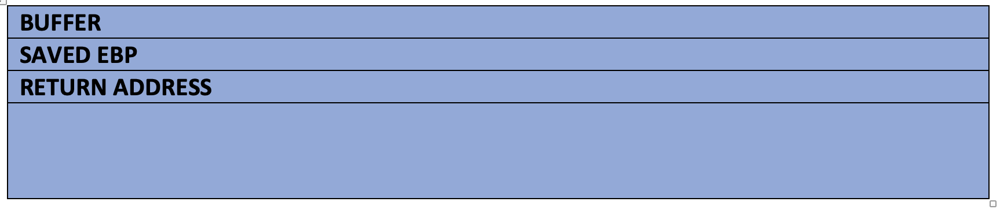

[1](/MyPortfolio/SSDCS/Unit01.html) | [2](/MyPortfolio/SSDCS/Unit02.html) | [3](/MyPortfolio/SSDCS/Unit03.html) | [4](/MyPortfolio/SSDCS/Unit04.html) | [5](/MyPortfolio/SSDCS/Unit05.html) | [6](/MyPortfolio/SSDCS/Unit06.html) | [7](/MyPortfolio/SSDCS/Unit07.html) | [8](/MyPortfolio/SSDCS/Unit08.html) | [9](/MyPortfolio/SSDCS/Unit09.html) | [10](/MyPortfolio/SSDCS/Unit10.html) | [11](/MyPortfolio/SSDCS/Unit11.html) | [12](/MyPortfolio/SSDCS/Unit12.html)


### Week One [una sabbatorum]

**Forum Post**

Buffer Overflow Attack

Before starting this module, I had some experience of buffer overflows both as a developer writing code that uses fixed buffers for variables (C  , C++ & ASM) but also as part of a team that has to patch commercial and internally developed software to mitigate against these flaws. In this post will look at the security flaw of buffer overflows.

Overview

What is a buffer overflow? When A program is run on an operating system the executable of that program and data structures will be held in memory in a very precise and known way The operating system (Windows, Linux, OSX) will call the main method of the code as a function, which then starts the flow for the rest of the program.

A Buffer overflow attack happens when more data than the size of the memory allocated for a variable or data structure is written allowing inputted data to overrun the bounds of the space allocated to store the data and therefore corrupt the heap or stack an attacker can use this flaw by crafting a custom input in the form of Shell Code in order to force the execution of arbitrary code this works by overwriting the values of the EIP (Instruction Pointer) , EBP (Base Pointer)  


**Normal Stack Overview**


**After Attack Stack**


With the Buffer overrun security flaw the execution of the program is redirected to run the injected shellcode with the permissions of the original process which is why when talking about security we need to run software with a least permissions required to operate as if the software is exploited it reduces the ability to escalate rights.  

**Example Shell Code**

The Following is an example of a shell code in this example running on a UNIX type platform this shellcode would spawn a command terminal. 

```ASM
;"\x41\xB0\x02\x49\xC1\xE0\x18\x49\x83\xC8\x61\x4C\x89\xC0\x48" +
;"\x05\x49\x89\xC4\x49\xBD\x01\x01\x11\x5C\xFF\xFF\xFF\xFF\x41" +
;"\xB1\xFF\x4D\x29\xCD\x41\x55\x49\x89\xE5\x49\xFF\xC0\x4C\x89" +
;"\xC0\x4C\x89\xE7\x4C\x89\xEE\x48\x83\xC2\x10\x0F\x05\x49\x83" +
;"\xE8\x08\x48\x31\xF6\x4C\x89\xC0\x4C\x89\xE7\x0F\x05\x48\x83" +
;"\xFE\x02\x48\xFF\xC6\x76\xEF\x49\x83\xE8\x1F\x4C\x89\xC0\x48" +
;"\x31\xD2\x49\xBD\xFF\x2F\x62\x69\x6E\x2F\x73\x68\x49\xC1\xED" +
;"\x08\x41\x55\x48\x89\xE7\x48\x31\xF6\x0F\x05" (Anon)
```
**Mitigate Against Buffer overflow attacks**

There are a number of ways to mitigate against buffer overflow attacks the first of these is at the OS level using Address Space Layout Randomization (ASLR) this is a memory-protection process for operating systems that guards against buffer-overflow attacks the way it achieves this is by ensuring that the memory addresses of running processes on systems are not predictable this means that flaws or vulnerabilities associated with these processes will be more difficult to exploit as the attacker cannot just run shell code pushed into memory

The Second way is at the application level by ensuring that data is validated at every step and the all user inputted data is classed as untrusted and is validated this however is not perfect if the attackers are proficient in reverse engineering and low level ASM programming they can bypass these checks by using a simple hex editor and editing the OP codes in the executable file. (Anon)

```

**Weekly Skills Matrix New Knowledge Gained**

- [x] 
- [x] 

**Happiness Level**
