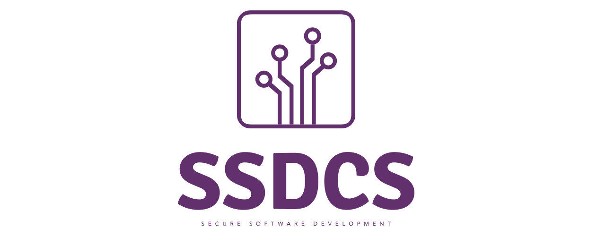

[1](/MyPortfolio/SSDCS/Unit01.html) | [2](/MyPortfolio/SSDCS/Unit02.html) | [3](/MyPortfolio/SSDCS/Unit03.html) | [4](/MyPortfolio/SSDCS/Unit04.html) | [5](/MyPortfolio/SSDCS/Unit05.html) | [6](/MyPortfolio/SSDCS/Unit06.html) | [7](/MyPortfolio/SSDCS/Unit07.html) | [8](/MyPortfolio/SSDCS/Unit08.html) | [9](/MyPortfolio/SSDCS/Unit09.html) | [10](/MyPortfolio/SSDCS/Unit10.html) | [11](/MyPortfolio/SSDCS/Unit11.html) | [12](/MyPortfolio/SSDCS/Unit12.html)
### Week Two [Duo]

# Forum Post

Some say that people are the biggest risk of cyber security this from experience unfortunately tends to be the case people are often the week link in security “Recent research has established that at least five elements are required to mould people’s behaviour in relation to security and control” (Jeimy J 2019)

*	Preparation
*	Responsibility
*	Management
*	Social elements
*	Regulation

however a lot of these risks can also be overcome using the following technologies.

**Access contro**l restricting physical access to the underlying servers running the services this however is limited to on premise hardware with the increase in the use of SAAS, IAAS and cloud services local physical access control is no longer enough an organization also need to partner with a cloud vendor who has good datacentre security made up of the following 

*	Secure Perimeter
*	Building Signage
*	Building Access
*	Security Operations Centre
*	Restricted Access to Data Centre Floor
*	Secure Hard Disk Destruction

**Google DataCentre Security** <https://youtu.be/kd33UVZhnAA>

**Audit** while this in itself will not stop incidents it will allow to see who was responsible and what was done ideally, we would want our system audit and logging to use a daemon such as syslog where logs can be offloaded onto a secondary server this prevents the altering of logs if a machine is comprised. Audit should also feed into the organizations IDS to proactively identify threat behaviour outside of normal so that an early Response can take place to prevent further breech of security. 

**Authentication** is the process of proving identity to a system or process one example of this is logging on to a computer the users account is authenticated by a means of an authentication method (password, Token, Biometrics) and then once authenticated the users account is permitted to logon to the device. We can overcome some of the human element by forcing Authentication to carry out tasks that have a security impact.

**Policy** an organization should have a well defined policy in regard to IT security including mandatory training (Annual) of all staff in security best practice as this will limit a security incident being caused by the human factor due to the staff being aware of security risks and their own responsibility in helping preventing breeches of security.

**Risk Assessment** can help mitigate against some of the risk down to the human factor by identifying the areas that have the potential to be exploited and thus enable organizations to put in measures to prevent these being able to be single person an example of this for example is putting in dual authorization so that a single person cannot take an action that could be a potential security breech without the signoff of a second person. This assessment can be done as an internal review or as part of an annual pentest security review.

**References** 

ISO https://www.iso.org/obp/ui/#iso:std:iso-iec:27000:ed-5:v1:en [Accessed 15.03.2022]
Google https://cloud.google.com/docs/security/infrastructure/design [Accessed 15.03.2022]
Microsoft Authentication Process https://docs.microsoft.com/en-us/windows-server/security/windows-authentication/credentials-processes-in-windows-authentication [Accessed 15.03.2022]
Jeimy J The Human Factor in Information Security https://www.isaca.org/resources/isaca-journal/issues/2019/volume-5/the-human-factor-in-information-security [Accessed 15.03.2022]

# Forum Response

Nice post and an interesting topic one I feel often gets overlooked when talking about security with the external risks being the ones that generally get the attention without looking at internal risks. As someone who has been poking around in databases professionally for at least the last decade I can say that if you have access to the backend database you more than often have the keys to the kingdom and in a lot of cases you can bypass application-level security and auditing by directly editing the data in the DBMS. 

One way that security can be implemented to prevent this type of attack and I’m speaking with my oracle hat on having implemented it in a commercial environment is the use of Oracle label Security (OLS) within the database as this allows sensitive data to be restricted within a database at the row level while still allowing access to the non-sensitive data Oracles Description of the technology is 

“Oracle Label Security (OLS) provides row-level security for your database tables. You can accomplish this by assigning one or more security labels that define the level of security you want for the data rows of the table.” (Oracle 2022)

**References**

https://docs.oracle.com/database/121/TDPSG/GUID-72D524FF-5A86-495A-9D12-14CB13819D42.htm#TDPSG30351 [Accessed 16.03.2022]

**Weekly Skills Matrix New Knowledge Gained**

- [x] 
- [x] 

**Happiness Level**
