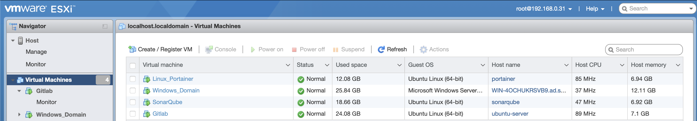
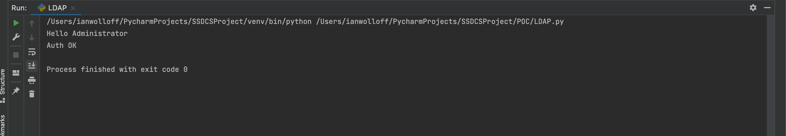
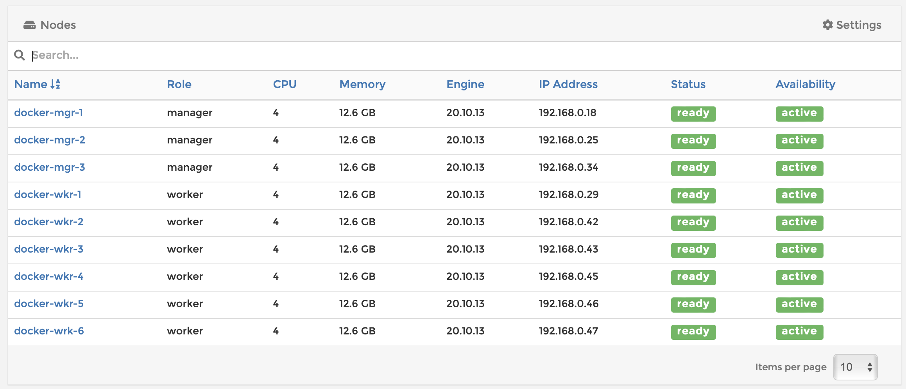
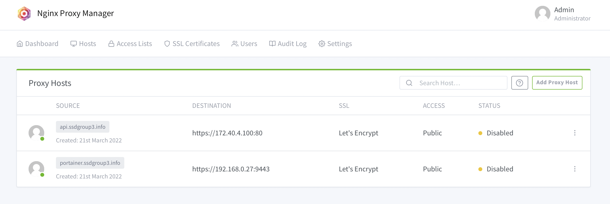

[1](/MyPortfolio/SSDCS/Unit01.html) | [2](/MyPortfolio/SSDCS/Unit02.html) | [3](/MyPortfolio/SSDCS/Unit03.html) | [4](/MyPortfolio/SSDCS/Unit04.html) | [5](/MyPortfolio/SSDCS/Unit05.html) | [6](/MyPortfolio/SSDCS/Unit06.html) | [7](/MyPortfolio/SSDCS/Unit07.html) | [8](/MyPortfolio/SSDCS/Unit08.html) | [9](/MyPortfolio/SSDCS/Unit09.html) | [10](/MyPortfolio/SSDCS/Unit10.html) | [11](/MyPortfolio/SSDCS/Unit11.html) | [12](/MyPortfolio/SSDCS/Unit12.html)
### Week Three [Tres Sabbati]


In this week we looked at

* Review the history and concepts of programming languages.
* Investigate language concepts using Python as an example.
* Describe best practices and methods to overcome common security issues.

This week I Started to think about the project and how in particular authentication of clients could happen so as a person who likes to see rather than just read about this I built a windows domain controller VM to try out some ideas on how our future implementation could be staged this process while overkill has given several insights that will be used to shape our project proposal I have a feeling this is going to be a nice project to get our teeth into as the scope we have is pretty large which I like.



Along with the hardware side with this I manged to write a python script as a proof of concept (POC) that would authenticate against the window’s active directory. This is one area that I am keen to take forward into our team project as from a security view separation of the application tier and the user details tier is a must and is also the way we do it when creating real word applications if for no other reason that you only need one set of user data that can be used across many application domains.

```python
# Authenticate Against a Windows Active Directory Domain Controller
# https://www.python-ldap.org/en/python-ldap-3.4.0/
import ldap

try:
    ldap.set_option(ldap.OPT_REFERRALS, 0)
    ldap.protocol_version = 3
    conn = ldap.initialize('ldap://192.168.0.111')
    conn.simple_bind_s('CN=Administrator,CN=Users,DC=ad,DC=ssdgroup3,DC=info', 'letmein')
    print("Hello", str(conn.whoami_s()).split('\\')[1])
    print("Auth OK")
    conn.unbind()
except ldap.INVALID_CREDENTIALS:
    print("Auth Failure")

```



Also as we plan to use multiple servers in our final project wrote some code to check if a server is up or down to enable smart routing of requests only to servers that are currently responding.

```python
def get_server_status(servers: list) -> list:
    servers_status = {}

    for x in servers:
        # Get Platform as Ping command syntax differs between windows and Unix/OSX
        if platform == "Windows":
            if os.system(f"ping {x} -n 1") == 0:
                servers_status[x] = 'OK'
            else:
                servers_status[x] = 'BAD'
        else:
            if os.system(f'ping -c 1 {x} > /dev/null 2>&1') == 0:
                servers_status[x] = 'OK'
            else:
                servers_status[x] = 'BAD'

    good_servers = [x for x, y in servers_status.items() if y == 'OK']
    bad_servers = [x for x, y in servers_status.items() if y == 'BAD']

    return [good_servers, bad_servers]


# Example of Use
Server_Status = get_server_status(['192.168.0.111', '192.168.0.14', '123.123.123.123'])
```
## Forum Response
In a traditional mainstream SSRF attack as in your example the hacker would trigger the remote server to make a connection to internal services within the perimeter of the infrastructure of the host. Or they would try to force the server to connect to external systems in order to leak sensitive data such as authorization tokens, usernames, passwords etc

One of the more interesting ways a SSRF can be leveraged it to use a SSRF weakness to attack the server itself that is hosting the application this involves forcing the application to make a request back to itself via the loopback network address (127.0.0.1 or localhost) as these addresses and hostnames would resolve back to the local device. 
An example of how this exploit cloud work is an application may query locally hosted REST API endpoints via a HTTP request. The attacker could try to visit the API endpoints directly. But these may be secured behind application firewalls and Access control Lists (ACLs) preventing accesses from external addresses.

If the request came from the local machine the access controls and firewall rules would be bypassed as the request would appear to come from a trusted internal host
References

Hacker-One Reports https://github.com/reddelexc/hackerone-reports/blob/master/tops_by_bug_type/TOPSSRF.md [Accessed 21.03.2022]
Calzavara Stefano (https://secgroup.dais.unive.it/wp-content/uploads/2020/03/more_server.pdf)
OWSAP https://cheatsheetseries.owasp.org/cheatsheets/Server_Side_Request_Forgery_Prevention_Cheat_Sheet.html [Accessed 21.03.2022]

## Project Investigations

Another Good Evening of work as have managed to set the first component of what may become our final solution 9 VMs to act as a HA cluster

* 3x Manager Nodes
* 3x Worker Nodes




All running Docker Swarm technology and setup to be HA and to also load balance plan is to also build a K8S cluster and to compare the two systems initial thoughts are Docker Swarm is the easier to use and setup but K8s has the bigger market footprint and is now the de-facto standard for these sort of workloads so with my Architects hat on I would say K8s is the way to go if we want to deliver a long term solution but enjoying investigating the technology as it’s not something I have had any exposure to before and might be something I would now consider using in a commercial project.

Along with that also setup a reverse SSL proxy so any connections to our services will be secured with Let’s Encrypt SSL Certificates as part of our design plan is where possible to secure everything with SSL certificates.



I feel this week is where we have hit our stride as a project good progress being made and the non project content is also helping by providing the skills and knowledge we need to produce our plans a good synergy between our own work and the course content looking forward to next week and also making more progress on our design.

### Buffer Overflows

I also Carried Out the buffer overflow excerise intersting topic and brought back a lot of memorys of when I used to have to write C code where you have to think about the size of the buffer you allocate and freeing up memory. 

```c
#include <stdio.h> 
int main(int argc, char **argv)
{
char buf[8]; // buffer for eight characters
printf("enter name:"); 
gets(buf); // read from stdio (sensitive function!)
printf("%s\n", buf); // print out data stored in buf
return 0; // 0 as return value
{

```

**Fixed the code to Remove the issue**

```c
#include <stdio.h>
int main(int argc, char **argv) {
    char buffer[8]; // buffer for eight characters
    printf("enter name:");
    fgets(buffer,8,stdin); // read from stdio (sensitive function!)
    printf("%s\n", buffer); // print out data stored in buf
    return 0;
}
```

Good progress = Happy Ian while some non UOE issues did get slightly in the way this week still managed to make progress though design is vitial to a good project must admit looking forward to the doing part of the work.

**Weekly Skills Matrix New Knowledge Gained**

- [x] Docker Swarm Technology
- [x] SSL Termination
- [x] Project Management 

**Happiness Level**

😀😀😀😀
