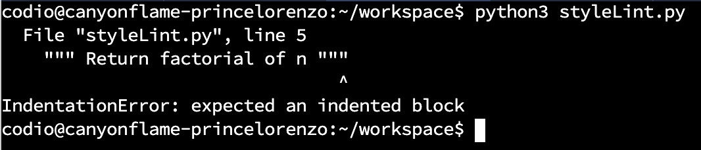
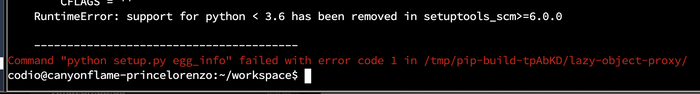
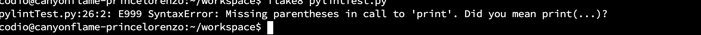
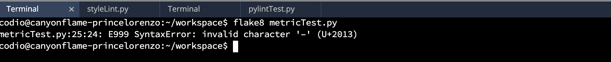

[1](/MyPortfolio/SSDCS/Unit01.html) | [2](/MyPortfolio/SSDCS/Unit02.html) | [3](/MyPortfolio/SSDCS/Unit03.html) | [4](/MyPortfolio/SSDCS/Unit04.html) | [5](/MyPortfolio/SSDCS/Unit05.html) | [6](/MyPortfolio/SSDCS/Unit06.html) | [7](/MyPortfolio/SSDCS/Unit07.html) | [8](/MyPortfolio/SSDCS/Unit08.html) | [9](/MyPortfolio/SSDCS/Unit09.html) | [10](/MyPortfolio/SSDCS/Unit10.html) | [11](/MyPortfolio/SSDCS/Unit11.html) | [12](/MyPortfolio/SSDCS/Unit12.html)
### Week Five [Hebdomada Quinque]

Good start to the week I some work in preparation for the development phase of the project work and got python talking over Secure LDAP (Port 636) to our ldap server this meanswe can be fully encrypted end to end though trying to setup non Microsoft generated certificates on a Microsoft 2022 domain controller could not be described as fun. I think however we are now in a good place and we can either put SSL certs on parts of our application that support SSL termination or put a SSL terminating proxy in front of the parts that don't have native SSL/TLS support.

```shell
ld = ldap_sslinit("svp-domain-01.ssdgroup3.info", 636, 1);
Error 0 = ldap_set_option(hLdap, LDAP_OPT_PROTOCOL_VERSION, 3);
Error 0 = ldap_connect(hLdap, NULL);
Error 0 = ldap_get_option(hLdap,LDAP_OPT_SSL,(void*)&lv);
Host supports SSL, SSL cipher strength = 256 bits
Established connection to svp-domain-01.ssdgroup3.info.
Retrieving base DSA information...
Getting 1 entries:
Dn: (RootDSE)
configurationNamingContext: CN=Configuration,DC=ssdgroup3,DC=info; 
currentTime: 04/04/2022 09:58:58 GMT Daylight Time; 
defaultNamingContext: DC=ssdgroup3,DC=info; 
dnsHostName: svp-domain-01.ssdgroup3.info; 
domainControllerFunctionality: 7 = ( WIN2016 ); 
domainFunctionality: 7 = ( WIN2016 ); 
dsServiceName: CN=NTDS Settings,CN=SVP-DOMAIN-01,CN=Servers,CN=Default-First-Site-Name,CN=Sites,CN=Configuration,DC=ssdgroup3,DC=info; 
forestFunctionality: 7 = ( WIN2016 ); 
highestCommittedUSN: 26066; 
isGlobalCatalogReady: TRUE; 
isSynchronized: TRUE; 
ldapServiceName: ssdgroup3.info:svp-domain-01$@SSDGROUP3.INFO; 
namingContexts (5): DC=ssdgroup3,DC=info; CN=Configuration,DC=ssdgroup3,DC=info; CN=Schema,CN=Configuration,DC=ssdgroup3,DC=info; DC=DomainDnsZones,DC=ssdgroup3,DC=info; DC=ForestDnsZones,DC=ssdgroup3,DC=info; 
rootDomainNamingContext: DC=ssdgroup3,DC=info; 
schemaNamingContext: CN=Schema,CN=Configuration,DC=ssdgroup3,DC=info; 
serverName: CN=SVP-DOMAIN-01,CN=Servers,CN=Default-First-Site-Name,CN=Sites,CN=Configuration,DC=ssdgroup3,DC=info; 
subschemaSubentry: CN=Aggregate,CN=Schema,CN=Configuration,DC=ssdgroup3,DC=info; 
supportedCapabilities (6): 1.2.840.113556.1.4.800 = ( ACTIVE_DIRECTORY ); 1.2.840.113556.1.4.1670 = ( ACTIVE_DIRECTORY_V51 ); 1.2.840.113556.1.4.1791 = ( ACTIVE_DIRECTORY_LDAP_INTEG ); 1.2.840.113556.1.4.1935 = ( ACTIVE_DIRECTORY_V61 ); 1.2.840.113556.1.4.2080 = ( ACTIVE_DIRECTORY_V61_R2 ); 1.2.840.113556.1.4.2237 = ( ACTIVE_DIRECTORY_W8 ); 
supportedControl (40): 1.2.840.113556.1.4.319 = ( PAGED_RESULT ); 1.2.840.113556.1.4.801 = ( SD_FLAGS ); 1.2.840.113556.1.4.473 = ( SORT ); 1.2.840.113556.1.4.528 = ( NOTIFICATION ); 1.2.840.113556.1.4.417 = ( SHOW_DELETED ); 1.2.840.113556.1.4.619 = ( LAZY_COMMIT ); 1.2.840.113556.1.4.841 = ( DIRSYNC ); 1.2.840.113556.1.4.529 = ( EXTENDED_DN ); 1.2.840.113556.1.4.805 = ( TREE_DELETE ); 1.2.840.113556.1.4.521 = ( CROSSDOM_MOVE_TARGET ); 1.2.840.113556.1.4.970 = ( GET_STATS ); 1.2.840.113556.1.4.1338 = ( VERIFY_NAME ); 1.2.840.113556.1.4.474 = ( RESP_SORT ); 1.2.840.113556.1.4.1339 = ( DOMAIN_SCOPE ); 1.2.840.113556.1.4.1340 = ( SEARCH_OPTIONS ); 1.2.840.113556.1.4.1413 = ( PERMISSIVE_MODIFY ); 2.16.840.1.113730.3.4.9 = ( VLVREQUEST ); 2.16.840.1.113730.3.4.10 = ( VLVRESPONSE ); 1.2.840.113556.1.4.1504 = ( ASQ ); 1.2.840.113556.1.4.1852 = ( QUOTA_CONTROL ); 1.2.840.113556.1.4.802 = ( RANGE_OPTION ); 1.2.840.113556.1.4.1907 = ( SHUTDOWN_NOTIFY ); 1.2.840.113556.1.4.1948 = ( RANGE_RETRIEVAL_NOERR ); 1.2.840.113556.1.4.1974 = ( FORCE_UPDATE ); 1.2.840.113556.1.4.1341 = ( RODC_DCPROMO ); 1.2.840.113556.1.4.2026 = ( DN_INPUT ); 1.2.840.113556.1.4.2064 = ( SHOW_RECYCLED ); 1.2.840.113556.1.4.2065 = ( SHOW_DEACTIVATED_LINK ); 1.2.840.113556.1.4.2066 = ( POLICY_HINTS_DEPRECATED ); 1.2.840.113556.1.4.2090 = ( DIRSYNC_EX ); 1.2.840.113556.1.4.2205 = ( UPDATE_STATS ); 1.2.840.113556.1.4.2204 = ( TREE_DELETE_EX ); 1.2.840.113556.1.4.2206 = ( SEARCH_HINTS ); 1.2.840.113556.1.4.2211 = ( EXPECTED_ENTRY_COUNT ); 1.2.840.113556.1.4.2239 = ( POLICY_HINTS ); 1.2.840.113556.1.4.2255 = ( SET_OWNER ); 1.2.840.113556.1.4.2256 = ( BYPASS_QUOTA ); 1.2.840.113556.1.4.2309 = ( LINK_TTL ); 1.2.840.113556.1.4.2330; 1.2.840.113556.1.4.2354; 
supportedLDAPPolicies (20): MaxPoolThreads; MaxPercentDirSyncRequests; MaxDatagramRecv; MaxReceiveBuffer; InitRecvTimeout; MaxConnections; MaxConnIdleTime; MaxPageSize; MaxBatchReturnMessages; MaxQueryDuration; MaxDirSyncDuration; MaxTempTableSize; MaxResultSetSize; MinResultSets; MaxResultSetsPerConn; MaxNotificationPerConn; MaxValRange; MaxValRangeTransitive; ThreadMemoryLimit; SystemMemoryLimitPercent; 
supportedLDAPVersion (2): 3; 2; 
supportedSASLMechanisms (4): GSSAPI; GSS-SPNEGO; EXTERNAL; DIGEST-MD5; 

```

A good second half of the week making good progress on the final proposal though I do have the tendency to go down a rabbit 🐇 hole like this week spent far too long looking at the diffent reverse proxies we could use for the solution currenty favouring HAProxy as it apepars to offer everything we need SSL Termination along with load balancing but this could well change before the project is complete I have also got the SSL side ready we are now officaly **SSD Group3 (Space Division)** 🚀🛰 looking foward to actually getting down to the implementation stage while a plan is important and is 100% required to deliver a successful project at some point the talking needs to stop and you actually need to produce something so looking forward to the next phase of the project. It Will also be nice to see if can put some of my Prince2 training to use. 

**👨‍💻 Ian From the future here as predicted above I changed my mind and dropped HA Proxy in favour of NGINX running in reverse proxy mode a number of reason but mainily HA Proxy had issues when running on VMs that were also running KeepAliveD**

**Seminar 3 Preparation (and e-portfolio entry)**

Run styleLint.py in Codio.

What happens when the code is run? Can you modify this code for a more favourable outcome? What amendments have you made to the code?

```python
def factorial(n):
""" Return factorial of n """
if n == 0:
return 1
else:
return n*factorial(n-1)
```


**Fixed Version**
```python
def factorial(n):
  """ Return factorial of n """
  if n == 0:
    return 1
  else:
    return n*factorial(n-1)
```
**Question 2**

pip install pylint
Run



 pylint 
on pylintTest.py

I had to upgrade the codio container to a newer version of python 3.10 to get pylint to work but once that was done the following results were obtained.

```shell
************* Module test
test.py:26:0: C0304: Final newline missing (missing-final-newline)
test.py:1:0: C0114: Missing module docstring (missing-module-docstring)
test.py:5:0: C0103: Constant name "shift" doesn't conform to UPPER_CASE naming style (invalid-name)
test.py:6:9: E0602: Undefined variable 'raw_input' (undefined-variable)
test.py:7:8: E0602: Undefined variable 'raw_input' (undefined-variable)
test.py:8:0: C0103: Constant name "letters" doesn't conform to UPPER_CASE naming style (invalid-name)
test.py:9:0: C0103: Constant name "encoded" doesn't conform to UPPER_CASE naming style (invalid-name)
test.py:13:12: C0103: Constant name "encoded" doesn't conform to UPPER_CASE naming style (invalid-name)
test.py:15:12: C0103: Constant name "x" doesn't conform to UPPER_CASE naming style (invalid-name)
test.py:16:12: C0103: Constant name "encoded" doesn't conform to UPPER_CASE naming style (invalid-name)
test.py:18:12: W0621: Redefining name 'letter' from outer scope (line 11) (redefined-outer-name)
test.py:20:20: C0103: Constant name "encoded" doesn't conform to UPPER_CASE naming style (invalid-name)
test.py:22:20: C0103: Constant name "x" doesn't conform to UPPER_CASE naming style (invalid-name)
test.py:23:20: C0103: Constant name "encoded" doesn't conform to UPPER_CASE naming style (invalid-name)
test.py:25:0: W0104: Statement seems to have no effect (pointless-statement)
test.py:26:0: W0104: Statement seems to have no effect (pointless-statement)

Review each of the code errors returned. Can you correct each of the errors identified by pylint?

-------------------------------------------------------------------
Your code has been rated at -2.00/10 (previous run: 5.00/10, -7.00)
```

```python
# SOURCE OF CODE: https://docs.pylint.org/en/1.6.0/tutorial.html
"""
Encode and Decode Function
"""
import string

SHIFT = 3
CHOICE = input("would you like to encode or decode?")
WORD = input("Please enter text")
LETTERS = string.ascii_letters + string.punctuation + string.digits
ENCODED = ''
if CHOICE == "encode":
    for letter in WORD:
        if letter == ' ':
            ENCODED = ENCODED + ' '
        else:
            X = LETTERS.index(letter) + SHIFT
            ENCODED = ENCODED + LETTERS[X]
if CHOICE == "decode":
    for letter in WORD:
        if letter == ' ':
            ENCODED = ENCODED + ' '
        else:
            X = LETTERS.index(letter) - SHIFT
            ENCODED = ENCODED + LETTERS[X]

print(ENCODED)
```

```shell
-------------------------------------------------------------------
Your code has been rated at 10.00/10 (previous run: 8.95/10, +1.05)
```

Run

flake8 
on pylintTest.py



Review the errors returned. In what way does this error message differ from the error message returned by pylint?

Run flake8 on metricTest.py. Can you correct each of the errors returned by flake8? What amendments have you made to the code?



**Weekly Skills Matrix New Knowledge Gained**

- Load Balancing [x] 
- SSL Certificates [x]
- Secure LDAP 

**Happiness Level**
😀😀😀😀
