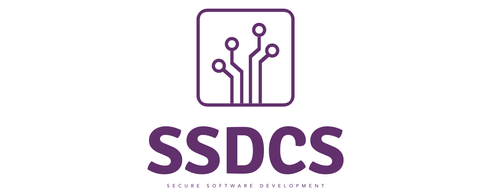
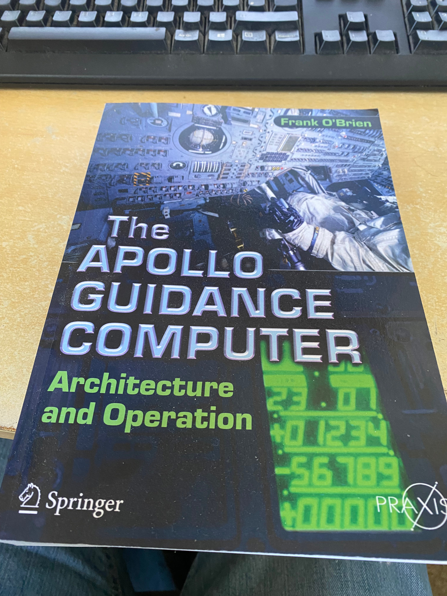

[1](/MyPortfolio/SSDCS/Unit01.html) | [2](/MyPortfolio/SSDCS/Unit02.html) | [3](/MyPortfolio/SSDCS/Unit03.html) | [4](/MyPortfolio/SSDCS/Unit04.html) | [5](/MyPortfolio/SSDCS/Unit05.html) | [6](/MyPortfolio/SSDCS/Unit06.html) | [7](/MyPortfolio/SSDCS/Unit07.html) | [8](/MyPortfolio/SSDCS/Unit08.html) | [9](/MyPortfolio/SSDCS/Unit09.html) | [10](/MyPortfolio/SSDCS/Unit10.html) | [11](/MyPortfolio/SSDCS/Unit11.html) | [12](/MyPortfolio/SSDCS/Unit12.html)
### Week Six [Hebdomada Sex]

This week we looked at

* Apply linters to support quality Python code development.
* Appreciate the different contributions from linters which are described as having similar objectives, and to realise their applicability and utility in different scenarios.
* Correct Python code so that it is free from error and consistent in its design.

In what may turn out to be not the smartest decision spent the best part of the weekend re-engineering the infratructrue side of the project to remove the requirment to have a windows active directory which is somewhat ironic as it was me who pushed for a identity directory over storing user details in a database. But my reason was to have a estate made up of a single platform as this presents a smaller vector for any exploits then having a mixed esate. Time will tell if we can totally remove windows form the platform at the very least we will need to test on windows as for a testing to be effective we need to test on all potential devices that could use the service. 

So we have started coding 🥳 we decided to split the work along a front end / back end axis with me taking the back end im quite happy with this setup as while I can do front end design is not something I or anyone in my family is strong at indeed I was once banned from School art class and told to take metal work insted. Could be trusted with a blowtorch but not a paint brush. So me doing the low level APIs will work out best for our team and will also tie in with the low level infrastructure part of the project that I have taken on.

Done a far amount of background reading this week on NASA ESA and the space program / ISS space station not needed for the project but was interested in the topic. While nothing to do with the project I can recommend **The Apollo Guidance Computer: Architecture and Operation (Springer Praxis Books)** for a historical context of coding and space have actually bought a copy for my own colelction of books

On a personal level it would appear I may be taking on the project management role for the implementation phase while I dont mind this as gives me some control over the direction of the project. It is not a area Im traditionally an expert in as im not the best at getting people to do tasks "Too Nice and not firm enough" as one of my managers once said. But in life we all have to do things that we are not the best with as that is how you grow as a person and gaining these project management skills will be of value to me not only in the sense of this and future university projects but in professional projects and life in general 

**Weekly Skills Matrix New Knowledge Gained**

- [x] Project Management

**Happiness Level**

😀😀😀😀
