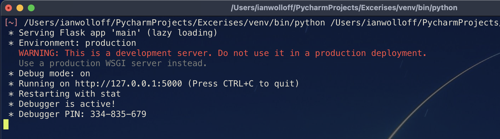
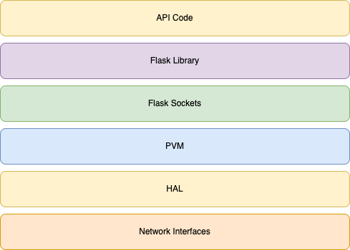

[1](/MyPortfolio/SSDCS/Unit01.html) | [2](/MyPortfolio/SSDCS/Unit02.html) | [3](/MyPortfolio/SSDCS/Unit03.html) | [4](/MyPortfolio/SSDCS/Unit04.html) | [5](/MyPortfolio/SSDCS/Unit05.html) | [6](/MyPortfolio/SSDCS/Unit06.html) | [7](/MyPortfolio/SSDCS/Unit07.html) | [8](/MyPortfolio/SSDCS/Unit08.html) | [9](/MyPortfolio/SSDCS/Unit09.html) | [10](/MyPortfolio/SSDCS/Unit10.html) | [11](/MyPortfolio/SSDCS/Unit11.html) | [12](/MyPortfolio/SSDCS/Unit12.html)
### Week Seven [Hebdomada Septem]

So our team proposal has finally been submitted 🥳 but we had to be brutal with the editing to get the submission within the word limit for the next set of students who do this module please raise the word limit as we had to cut quite a few well researched sections just to get it in under a imposed limit. that being said quite happy with our proposal but now we have to implement what we have designed 

In other project news backend infrastructure build out has had both a good and negitive week on the good side we have now got DR and a backup solution in place so in the event of any issues we can recover our indvidual components on the not so good side a new version of the core Linux Distro we plan to use is due to be released this week so I may need to rebuild some of our platform to take advantage of the improved secrity included in the new version if nothing else it has a cool name **22.04 Jammy Jellyfish** I thought that now the final proposal has been submitted in these weekly posts I wold include some information on the build process and what has changed from our initial plan as "no plan lasts past first contact with the enemy" [Field Marshal Helmuth von Moltke] so I 100% expect that there will need to be changes to the design in the delivery phase of the project.

**Weekly Change to Proposal**

| Area  | Change  |
|---|---|
| OS  | Update to Linux 22.04  |
| Container  | Inclusion of WatchTower container to autoupgrade containers |
| Storage | Moved Local Storage to ZFS ISCII Block Storage |


New Patch released for Vmware ESXI so patched our Vmware host to the latest7.0U3D version to get the latest hotfixes

```shell
esxcli network firewall ruleset set -e true -r httpClient
esxcli software profile update -p ESXi-7.0U3d-19482537-standard -d \
https://hostupdate.vmware.com/software/VUM/PRODUCTION/main/vmw-depot-index.xml
esxcli network firewall ruleset set -e false -r httpClient
```
So read an article about the technology NASA https://www.computerweekly.com/blog/Open-Source-Insider/International-Space-Station-adopts-Debian-Linux-drops-Windows-Red-Hat-into-airlock actually use (Debian Linux in space and RedHat for ground Side Proccessing) so inspired to have a look and see if we can migrate our technology stack to match as we want to be as close to real life as possible this may turn out to be a seamed a good idea at the time decision but better to try and fail then not to try at all.  


## Python Shell

So Along with the project work I also completed the excerise of making a python shell I quite enjoyed this and went though a couple of itterations but settled on a version that made extensive use of lamda functions to fulfill and actually go beyond the spec 

```python
import os

class Shell_Prompt():

    def shell_prompt(self):
        return '$'

    def list_files(self):
        return [file for file in os.listdir(os.path.realpath(os.path.join(os.getcwd(), os.path.dirname(__file__)))) if os.path.isfile(file)]

    def print_files(self):
        for x in self.list_files():
            print(x)

    @staticmethod
    def input_error():
        print("Input Error")
        return None

    @staticmethod
    def maths(opp, x, y):
        return {
            'add': lambda: x + y,
            'sub': lambda: x - y,
            'mul': lambda: x * y,
            'div': lambda: x / y,
        }.get(opp)()


Shell = Shell_Prompt()

while True:
    switch = {
        "LIST": lambda: Shell.print_files(),
        "ADD": lambda: print(Shell.maths("add", int(command[1]), int(command[2]))) if len(command) == 3 else Shell.input_error(),
        "SUB": lambda: print(Shell.maths("sub", int(command[1]), int(command[2]))) if len(command) == 3 else Shell.input_error(),
        "MUL": lambda: print(Shell.maths("mul", int(command[1]), int(command[2]))) if len(command) == 3 else Shell.input_error(),
        "DIV": lambda: print(Shell.maths("div", int(command[1]), int(command[2]))) if len(command) == 3 else Shell.input_error(),
        "EXIT": exit
    }
    command = [x for x in input(Shell.shell_prompt).split(' ')]
    switch.get(command[0], Shell.input_error)()

```
**Bandit Report**

```shell
Test results:
        No issues identified.

Code scanned:
        Total lines of code: 33
        Total lines skipped (#nosec): 0

Run metrics:
        Total issues (by severity):
                Undefined: 0
                Low: 0
                Medium: 0
                High: 0
        Total issues (by confidence):
                Undefined: 0
                Low: 0
                Medium: 0
                High: 0
Files skipped (0):

```

Potential Security Flaws still exist 

* Type Conversion by passing in a type the program is not expecting we could cause the  
* Command Extension 

### API Excerise

```python
from flask import Flask
from flask_restful import Api, Resource, reqparse
 
app = Flask(__name__)
api = Api(app)
 
users = [
    {
        "name": "James",
        "age": 30,
        "occupation": "Network Engineer"
    },
    {
        "name": "Ann",
        "age": 32,
        "occupation": "Doctor"
    },
    {
        "name": "Jason",
        "age": 22,
        "occupation": "Web Developer"
    }
]
 
class User(Resource):
    def get(self, name):
        for user in users:
            if(name == user["name"]):
                return user, 200
        return "User not found", 404
 
    def post(self, name):
        parser = reqparse.RequestParser()
        parser.add_argument("age")
        parser.add_argument("occupation")
        args = parser.parse_args()
 
        for user in users:
            if(name == user["name"]):
                return "User with name {} already exists".format(name), 400
 
        user = {
            "name": name,
            "age": args["age"],
            "occupation": args["occupation"]
        }
        users.append(user)
        return user, 201
 
    def put(self, name):
        parser = reqparse.RequestParser()
        parser.add_argument("age")
        parser.add_argument("occupation")
        args = parser.parse_args()
 
        for user in users:
            if(name == user["name"]):
                user["age"] = args["age"]
                user["occupation"] = args["occupation"]
                return user, 200
        
        user = {
            "name": name,
            "age": args["age"],
            "occupation": args["occupation"]
        }
        users.append(user)
        return user, 201
 
    def delete(self, name):
        global users
        users = [user for user in users if user["name"] != name]
        return "{} is deleted.".format(name), 200
      
api.add_resource(User, "/user/<string:name>")
 
app.run(debug=True)
```
## Question One 

Run the API.py code. Take a screenshot of the terminal output. What command did you use to compile and run the code?



Command used to run the code contained in main.py was

```shell
/Users/ianwolloff/PycharmProjects/Excerises/venv/bin/python /Users/ianwolloff/PycharmProjects/Excerises/main.py
```

After first 

* Setting up a venv for the project
* pip install flask
* pip install flask_restful

## Question Two

Run the following command at the terminal prompt: w3m http://127.0.0.1:5000/user/Ann

As my code development is taking place on OSX we can replace the w3m command for the curl command but the outcome is the same when run the following out put is produced

```json
{
    "name": "Ann",
    "age": 32,
    "occupation": "Doctor"
}
```

The reason why we get this output is down to the folloing block of code

```python
    def get(self, name):
        for user in users:
            if (name == user["name"]):
                return user, 200
        return "User not found", 404
```
 
 because the request we are making is a standard get request we execute the get block above and because the name we are passing "Ann" exists in the users list defined in the code the validation in the if statment passes and we return the Ann user dictonary with a http code of 200 success.
 
## Question Three

Run the following command at the terminal prompt: w3m http://127.0.0.1:5000/user/Adam What happens when this command is run, and why?

When we run the following command **curl http://127.0.0.1:5000/user/Adam** we get the folloing output "User not found" the reason for this is the if statment in the get function if the name passed does not exist in the user list made up of James Ann Jason then the return contained in the if block will not fire and insted the "User not found" value will be returned along with a http status code of 404 (Not Found) 

## Question Four

What capability is achieved by the flask library?

The capability the flask library is it removes abstracts the low level socket programming required to handle the http requests made to the api code if this was not the case then as developers we would have to deal with low level sockets datagrams packets and protocols for network comunication. the flask library handles these functions and presents them to the developer as a series of classes and methods.

This then allows the developer to focus on the sevices they are trying to deliver in their application rather then the mechnicism of delivery



**Weekly Skills Matrix New Knowledge Gained**

- [x] Python Shells and use of Lamda calls  
- [x] Debian Linux

So Actually quite happy at the moment with how the project is going pieces are falling into place even my project management is going quite well though also beginning to feel the pressure of making sure we actualy deliver on or design. Plan for the worst hope for the best I really want to get the building blocks in place in the next week so that we can focus on the code but now I have got a bit of project management experence I have learnt to be realistic so may take a bit longer but the plan is to do it right do it once even if that takes a bit longer in the inital phase. 

Though also enjoying the challenge of this project its pretty cool that we can take the project where we want within the project domain that freedom some may not like it as they pefer to have strict guidlines I quite like it as it allows me to use a full set of skills Application Design , Infrastructure , Networking , Security got a feeling this project may be one of the defining bits of work I do on this course looking forward to adding to the project

**Bring it On**

**Happiness Level**
😀😀😀😀
