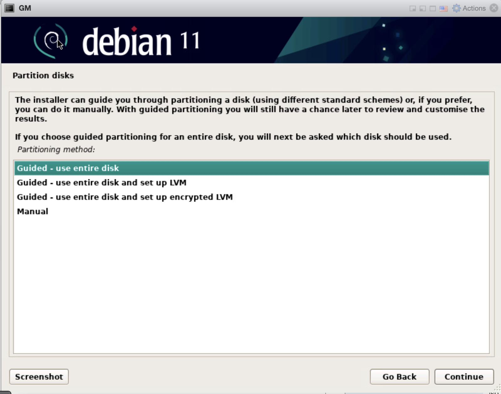

[1](/MyPortfolio/SSDCS/Unit01.html) | [2](/MyPortfolio/SSDCS/Unit02.html) | [3](/MyPortfolio/SSDCS/Unit03.html) | [4](/MyPortfolio/SSDCS/Unit04.html) | [5](/MyPortfolio/SSDCS/Unit05.html) | [6](/MyPortfolio/SSDCS/Unit06.html) | [7](/MyPortfolio/SSDCS/Unit07.html) | [8](/MyPortfolio/SSDCS/Unit08.html) | [9](/MyPortfolio/SSDCS/Unit09.html) | [10](/MyPortfolio/SSDCS/Unit10.html) | [11](/MyPortfolio/SSDCS/Unit11.html) | [12](/MyPortfolio/SSDCS/Unit12.html)
### Week Seven [Hebdomada Septem]

So our team proposal has finally been submitted 🥳 but we had to be brutal with the editing to get the submission within the word limit for the next set of students who do this module please raise the word limit as we had to cut quite a few well researched sections just to get it in under a imposed limit. that being said quite happy with our proposal but now we have to implement what we have designed 

In other project news backend infrastructure build out has had both a good and negitive week on the good side we have now got DR and a backup solution in place so in the event of any issues we can recover our indvidual components on the not so good side a new version of the core Linux Distro we plan to use is due to be released this week so I may need to rebuild some of our platform to take advantage of the improved secrity included in the new version if nothing else it has a cool name **22.04 Jammy Jellyfish** I thought that now the final proposal has been submitted in these weekly posts I wold include some information on the build process and what has changed from our initial plan as "no plan lasts past first contact with the enemy" [Field Marshal Helmuth von Moltke] so I 100% expect that there will need to be changes to the design in the delivery phase of the project.

**Weekly Change to Proposal**

| Area  | Change  |
|---|---|
| OS  | Update to Linux 22.04  |
| Container  | Inclusion of WatchTower container to autoupgrade containers |
| Storage | Moved Local Storage to ZFS ISCII Block Storage |


New Patch released for Vmware ESXI so patched our Vmware host to the latest7.0U3D version to get the latest hotfixes

```shell
esxcli network firewall ruleset set -e true -r httpClient
esxcli software profile update -p ESXi-7.0U3d-19482537-standard -d \
https://hostupdate.vmware.com/software/VUM/PRODUCTION/main/vmw-depot-index.xml
esxcli network firewall ruleset set -e false -r httpClient
```
So read an article about the technology NASA https://www.computerweekly.com/blog/Open-Source-Insider/International-Space-Station-adopts-Debian-Linux-drops-Windows-Red-Hat-into-airlock actually use (Debian Linux in space and RedHat for ground Side Proccessing) so inspired to have a look and see if we can migrate our technology stack to match as we want to be as close to real life as possible this may turn out to be a seamed a good idea at the time decision but better to try and fail then not to try at all.  



## Python Shell

So Along with the project work I also completed the excerise of making a python shell I quite enjoyed this and went though a couple of itterations but settled on a version that made extensive use of lamda functions to fulfill and actually go beyond the spec 

```python
import os

class Shell_Prompt():

    def shell_prompt(self):
        return '$'

    def list_files(self):
        return [file for file in os.listdir(os.path.realpath(os.path.join(os.getcwd(), os.path.dirname(__file__)))) if os.path.isfile(file)]

    def print_files(self):
        for x in self.list_files():
            print(x)

    @staticmethod
    def input_error():
        print("Input Error")
        return None

    @staticmethod
    def maths(opp, x, y):
        return {
            'add': lambda: x + y,
            'sub': lambda: x - y,
            'mul': lambda: x * y,
            'div': lambda: x / y,
        }.get(opp)()


Shell = Shell_Prompt()

while True:
    switch = {
        "LIST": lambda: Shell.print_files(),
        "ADD": lambda: print(Shell.maths("add", int(command[1]), int(command[2]))) if len(command) == 3 else Shell.input_error(),
        "SUB": lambda: print(Shell.maths("sub", int(command[1]), int(command[2]))) if len(command) == 3 else Shell.input_error(),
        "MUL": lambda: print(Shell.maths("mul", int(command[1]), int(command[2]))) if len(command) == 3 else Shell.input_error(),
        "DIV": lambda: print(Shell.maths("div", int(command[1]), int(command[2]))) if len(command) == 3 else Shell.input_error(),
        "EXIT": exit
    }
    command = [x for x in input(Shell.shell_prompt).split(' ')]
    switch.get(command[0], Shell.input_error)()

```
**Bandit Report**

```shell
Test results:
        No issues identified.

Code scanned:
        Total lines of code: 33
        Total lines skipped (#nosec): 0

Run metrics:
        Total issues (by severity):
                Undefined: 0
                Low: 0
                Medium: 0
                High: 0
        Total issues (by confidence):
                Undefined: 0
                Low: 0
                Medium: 0
                High: 0
Files skipped (0):

```

Potential Security Flaws still exist 

* Type Conversion by passing in a type the program is not expecting we could cause the  
* Command Extension 

**Weekly Skills Matrix New Knowledge Gained**

- [x] Python Shells and use of Lamda calls  
- [x] Debian Linux

**Happiness Level**
