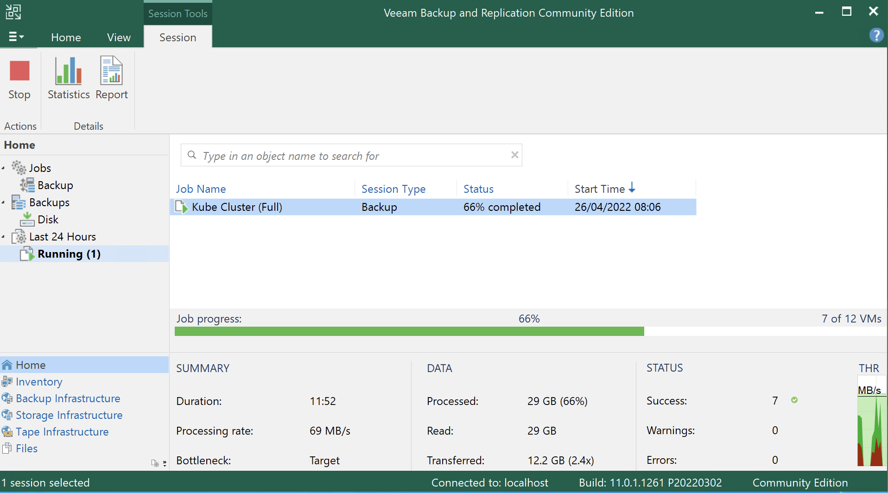

[1](/MyPortfolio/SSDCS/Unit01.html) | [2](/MyPortfolio/SSDCS/Unit02.html) | [3](/MyPortfolio/SSDCS/Unit03.html) | [4](/MyPortfolio/SSDCS/Unit04.html) | [5](/MyPortfolio/SSDCS/Unit05.html) | [6](/MyPortfolio/SSDCS/Unit06.html) | [7](/MyPortfolio/SSDCS/Unit07.html) | [8](/MyPortfolio/SSDCS/Unit08.html) | [9](/MyPortfolio/SSDCS/Unit09.html) | [10](/MyPortfolio/SSDCS/Unit10.html) | [11](/MyPortfolio/SSDCS/Unit11.html) | [12](/MyPortfolio/SSDCS/Unit12.html)
### Week Eight [Hebdomada Octo]

Positive but also slightly anoying start to the week on the postive side infrastructure build out is on schedule even with our change to base os which is turning out to be a good decision as a our VM images have reduced in size from 150GB per VM down to about 9GB per image while storage is not a big concern our current storage array has a 8TB ZFS pool smaller is better on a secuirty side as it means the attack surface of the OS underpinning our service is reduced. 

**DR and BCP**

Along with the actual delivery we need to think about our Disaster recovery position as a solutuon needs to be able to recover from unforseen events and as our domain is in a hostile environment this is important. To this regard as part of our plan is to include backup and recovery solution as the industry leader and because there is a free tier we have gone with a VEEAM based solution.



Been a good week on the project gone from a idea to a proposal and now to the start of a actual product there are three main parts of our solution

* User Interface
* Data Collection
* APIs

I have been asigned the task of buildig the APIS that the rest of the solution will use while not the part of the project that has the wow factor without a strong underpinning the services that are built on top of the APIS will suffer so have been reading up on API Design the Flask Micro framework and JWT tokens. As I want to build a strong set of APIs 

We had a good dicussion about encryption which was quite interesting so wrote a quick ROT13 which I class more of a encoding techninque then a real encryption standard actually rember using it when talking part in usenet dicussion forums back in the eary 90s

```python
def rot13(q: str) -> str:
    result: list = []
    for x in q:
        if x.isalpha():
            shift = 13 if 'Z' < x < 'n' or x < 'N' else -13
            result.append(chr(ord(x) + shift))
        else:
            result.append(x)
    return ''.join(result)
```

**GitHub Actions**

So in a effort to save time during commits of my API code which is undergoing a period of rapid development setup a github action to produce and publish the docker image this also solves another issue I was having because my main development machine is a M1 Macbook based on ARM architecture people using x86 based devices were getting problems running the docker image so getting github to produce the image aslo resolves that issue.


```yml
name: Build and Publish

on:
  push:
    branches: [main]
  pull_request:

jobs:
  build_docker_image:
    name: Build Docker image
    runs-on: ubuntu-latest

    steps:
      - name: Checkout code
        uses: actions/checkout@v2

      - name: Set up Docker Buildx
        id: buildx
        uses: docker/setup-buildx-action@v1

      - name: Login to Github Packages
        uses: docker/login-action@v1
        with:
          registry: ghcr.io
          username: ${{ github.actor }}
          password: ${{ secrets.GHCR_PAT }}
  
      - name: Build image and push to Docker Hub and GitHub Container Registry
        uses: docker/build-push-action@v2
        with:
          context: ./Src/API/DB_Intergration/
          tags: |
            ghcr.io/uoessdgroup3/db_api:latest
          # build on feature branches, push only on main branch
          push: ${{ github.ref == 'refs/heads/main' }}

      - name: Image digest
        run: echo ${{ steps.docker_build.outputs.digest }}
```

Really enjoying playing with the Github actions a bit different to the GitLab CI/DI im use to but quite powerful what you can do with a few lines of yml automation I have a feeling is going to be a key thing in the project as if we can automate alot of the tasks then that allow us to focus on the coding and design its not allways about working harder sometimes you need to worker smarter by removing the barriers that prevent the developers from developing. This is a lesson I learned quite a few years ago so is something I will try to implement in our project. Will I be sucecssful dont know but allways worth a try.  

# MariaDB

So after making the decison to move our DMBS to maria DB due to driver issues on postgre we now needed to make MariaDB HA to do this we used a couple of methods the first was to setup replication between MariaDB hosts this was first configured as Master -> Slave but after some thought we reconfigured MariaB to a master to master configuration that way any update on any host would be replicated. Along with this we also connfigured MariaDB to use SSL Certificates so the replication and any data access would be secured behind 256bit encryption

The second way was to install from source keepalived so that we could have a virtual IP for our service to connect to but in the event of a host failure the connection our service used would failover to the second host We tested this by failing on of the hosts and it failed over to the second maria DB instance and because the data had been replicated the service remained up and did not suffer an outage. 

You know when you have been reading too much on a subject when your searching takes you to bedding on the subject ISS bedding anyone ? 😀 but on the whole a good positive week


**Weekly Skills Matrix New Knowledge Gained**

- [x] Encryption
- [x] YAML and Github Actions
- [x] DBMS Config and Replication

**Happiness Level**
😀😀😀😀😀
