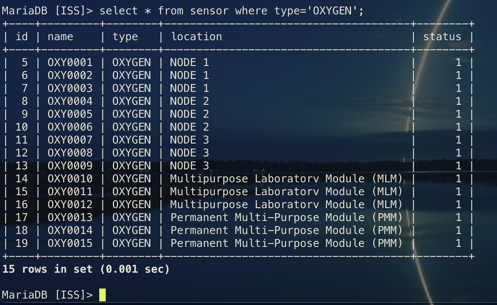
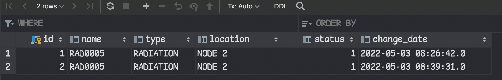
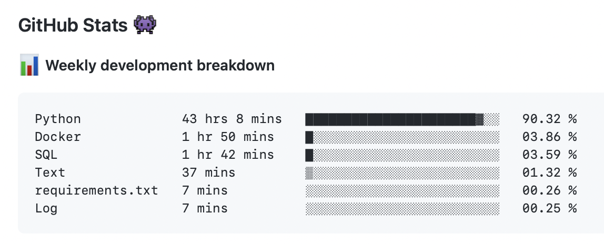

[1](/MyPortfolio/SSDCS/Unit01.html) | [2](/MyPortfolio/SSDCS/Unit02.html) | [3](/MyPortfolio/SSDCS/Unit03.html) | [4](/MyPortfolio/SSDCS/Unit04.html) | [5](/MyPortfolio/SSDCS/Unit05.html) | [6](/MyPortfolio/SSDCS/Unit06.html) | [7](/MyPortfolio/SSDCS/Unit07.html) | [8](/MyPortfolio/SSDCS/Unit08.html) | [9](/MyPortfolio/SSDCS/Unit09.html) | [10](/MyPortfolio/SSDCS/Unit10.html) | [11](/MyPortfolio/SSDCS/Unit11.html) | [12](/MyPortfolio/SSDCS/Unit12.html)
### Week Nine [Hebdomada Novem]

This week looked at

* Investigate the application of CRUD capabilities in Python.
* Continue to expand our knowledge on the capabilities of further Python libraries.
* Reflect on the utility of an ontology to support a distributed architecture

Got a Bit Delayed with the coding but put together a forum post on the TrueCrypt Topic

**Introduction**

TrueCrypt in the early 90s to Mid 2000s was the go to application for anyone wanting to implement OS level encryption as the application was lightweight cross platform (Windows, OSX , Linux , BSD) and supported a wide range of encryption algorithms. Plus, it was free at the time most FDE (Full Disk Encryption) products were commercial and outside the price range of many organizations this was before FDE was standard on consumer operating systems (Bit locker [Microsoft] and File vault [Apple]). At the time in my own company, we were paying £40,000 a year for PGP full disk encryption on our corporate workstations.

**Real World Example**

From personal experience I first used TrueCrypt in a professional sense in 2004 the UK Local Authority I worked for had a large number of adults and children’s data records of a very sensitive nature and as with all IT systems at the time there were periods where the systems would be offline for maintenance.

As the system was used by social workers and the police and was the key system used for child protection / safeguarding these workers needed access to the data 24/7 so our solution at the time was to provide a standalone device at the external sites and on a maintenance or downtime event someone quite often myself would drive to these sites with a TrueCrypt see back on topic encrypted hard drive with the latest backup of the system that could then be mounted and used as a local version for the period the main system was offline. It was TrueCrypt that made this possible as legally as custodians of that data we would not be happy leaving a copy of very personal data offsite as if that data got into the wrong hands, it could have had very negative outcomes first of all for the people in the data and secondary for us as the organization responsible for managing the data.

So when the news came that TrueCrypt was being de-supported by the developer we needed to find another solution though to be fair our somewhat heath Robinson solution was getting naturally towards the end of its life at this point as the market for FDE products had matured and with the inclusion of OS level protections that could be centrally managed via Group Policy’s we made the decision to not only move our social care solution to Microsoft Bit locker but also our corporate desktops from PGP FDE to Microsoft Bit locker

In answer to the question Would you be prepared to recommend TrueCrypt to a friend as a secure storage environment? I would have to answer no not because I think it would expose the user to risk of having their data compromised outside of nation states with nation state resources that risk for a normal user would be quite low but because but there are now better solutions available then TrueCrypt that would be easier to use for the end user without the known issues that TrueCrypt has such as

*	MITRE. CVE-2015-7358. Sept. 2015. 
*	MITRE. CVE-2015-7359. Sept. 2015. 

As IT professionals we have a duty to recommend the best solution for anyone taking our advice both paid and non-paid consultancy. Also if we look at the Work Done by the Fraunhofer Institute and analysis on the code base flaws or weaknesses were identified in the following areas of the codebase

*	Security Features 
*	Time and State 
*	Errors
*	Code Quality 
*	Encapsulation 
*	Environment
Baluda, M. et al. (2015)

While all software above a certain complexity will have bugs the other issue, I would have recommending TrueCrypt to someone in 2022 is the fact that it is in a no longer supported and would not be regression tested on new versions of the underlying Operating Systems which would be considered a major risk as there is the possibility of the current TrueCrypt software not working with a future OS update. On this the UK NCSC (National Cyber Security Centre) says “All software, including device operating systems, will eventually become out of date. Ideally, once out of date, technology should not be used.” (NCSC).

As to the question of does the TrueCrypt software contain unfixed security flaws all of the research would indicate no major flaws but that is not to say there are not issues as the application was designed and implemented before use of more modern security and code analysis tools so there would be coding decisions and design patterns in the software that today would not be considered best practice.
In Summary TrueCrypt at the time was considered a good solution but as the IT landscape has moved on since 2014 the solutions we deploy also need to move with the changing requirements both of the users and the software systems we use. As the old saying goes “evolve or die” and without maintenance TrueCrypt while deserving of its place in IT history in 2022 should be put out to pasture.

**References** 

Baluda, M. et al. (2015). Security Analysis of TrueCryptpdfauthor. [Online]. Available at: https://www.bsi.bund.de [Accessed 2 May 2022].

https://www.bsi.bund.de/SharedDocs/Downloads/EN/BSI/Publications/Studies/Truecrypt/Truecrypt.pdf?__blob=publicationFile&v=1

Balducci, A., Devlin, S. and Ritter, T. Open Crypto Audit Project TrueCrypt Cryptographic Review. [Accessed 2 May 2022]. https://opencryptoaudit.org/reports/TrueCrypt_Phase_II_NCC_OCAP_final.pdf

 CVE Database (cve.mitre.org) [Online]. Available at: https://cve.mitre.org/ [Accessed 2 May 2022].
https://cve.mitre.org/cgi-bin/cvename.cgi?name=CVE-2014-4115
https://cve.mitre.org/cgi-bin/cvename.cgi?name=CVE-2015-7358
https://cve.mitre.org/cgi-bin/cvename.cgi?name=CVE-2015-7359

BitLocker Frequently Asked Questions (FAQ) | Microsoft Docs. [Online]. Available at: https://docs.microsoft.com/en-us/previous-versions/windows/it-pro/windows-server-2012-r2-and-2012/hh831507(v=ws.11) [Accessed 2 May 2022].

Keeping devices and software up to date - NCSC.GOV.UK. [Online]. Available at: https://www.ncsc.gov.uk/collection/device-security-guidance/managing-deployed-devices/keeping-devices-and-software-up-to-date [Accessed 2 May 2022].


## Project Update

**Oxygen**

Along with Pyython coding have started to populate the MariaDB with some data so that our demo look like real life so far have added in some oxygen sensors.



**Sensor Audit**

One thing I did want to include in the project was some form of tracking when a sensor goes offline / online I had a look at doing this in python and while possible It is not the best way to get the outcome we want the better way is to create a Database trigger so that when the status of a sensor chnages a new record is created in a audit table. This has the advatnage of being at the DBMS tier rather then adding additional processing work onto our application tier. the trigger I created was

```sql
create trigger tgr_sensor_audit
    after update on sensor
    for each row
    BEGIN
        IF OLD.status <> new.status THEN
    insert into sensor_history(
        name,
        type,
        location,
        status,
        change_date

    )
    values(
        old.name,
        old.type,
        old.location,
        new.status,
        now()
    );
        END IF;
END; 
```



While Coding is the fun part of any project as the talking has stopped and you now have to turn the plans into a deliverable solution that being said personaly from looking at the weekly stats I have spent more time coding this week then working so plan to take a step back in the following week as 80+ hour weeks are not healthy from a physical or mental point of view. So plan is to do some initial drafting of our readme file along with define some test cases and then come back to the coding.



**Weekly Skills Matrix New Knowledge Gained**

- [x] Software Design and DAST Testing
- [x] Database Triggers and Peformance Tweaking
- [x] Markdown 

Motivation this week while still high was not as high as previous weeks not sure why as content is still good and project is now almost at the point where the technology is working. But also not been feeling 100% so plan to have a rest over the weekend and come back enthused and motivated. 

**Happiness Level**

😀😀
