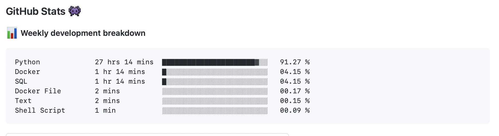

[1](/MyPortfolio/SSDCS/Unit01.html) | [2](/MyPortfolio/SSDCS/Unit02.html) | [3](/MyPortfolio/SSDCS/Unit03.html) | [4](/MyPortfolio/SSDCS/Unit04.html) | [5](/MyPortfolio/SSDCS/Unit05.html) | [6](/MyPortfolio/SSDCS/Unit06.html) | [7](/MyPortfolio/SSDCS/Unit07.html) | [8](/MyPortfolio/SSDCS/Unit08.html) | [9](/MyPortfolio/SSDCS/Unit09.html) | [10](/MyPortfolio/SSDCS/Unit10.html) | [11](/MyPortfolio/SSDCS/Unit11.html) | [12](/MyPortfolio/SSDCS/Unit12.html)
### Week Ten [Hebdomada Decem]



The plan to take a step back from coding sort of worked as the amount of time coding was down from last weekleaading to a less stressed Ian and some serious progress has been made as a team we did our first end to end test and we succesfully got our dataproducer sending data to our Kafka cluster which we have now built we then created a Kafka connector container that picked up the data and successfully used our API to write the data into our MariaDB. On a personal note it was great to see that after weeks of design and coding that the solution was viaiable. We now need a big push to smooth out the rough edges and to start documentation on the infrastructure and coding side of the work.

We also got some key tecnology working we have now implemented watchtower on our web hosts (Docker) that when a new image is produced via our automated Github actions new docker containers get buildt on every push to the main branch it will see that and automatically update the running container with the new version without us having to manually reconfigure the hosts. 

**WatchTower Log**

```shell
time="2022-05-08T10:30:30Z" level=info msg="Found new ghcr.io/uoessdgroup3/db_api:latest image (a1bece86fe57)"
time="2022-05-08T10:30:33Z" level=info msg="Stopping /ssdgroup3_database_api (067a01e766c1) with SIGTERM"
time="2022-05-08T10:30:35Z" level=info msg="Creating /ssdgroup3_database_api"
time="2022-05-08T10:30:35Z" level=info msg="Removing image dbb9d13f27c0"
time="2022-05-08T10:30:35Z" level=info msg="Session done" Failed=0 Scanned=4 Updated=1 notify=no
```

**TrueCrypt**

Had some time to think about the TrueCrypt issue so updated my Forum Post

Having had some time now to think about it my initial position has not changed in not recommending TrueCrypt, I now realise I may have been overly harsh in regard to TrueCrypt. Possibly down to personal experience which while useful to draw on can sometimes cause viewpoints to be distorted.

TrueCrypt as a solution is not alone or unusual in the issues it faces. Abandonware is a growing problem in the IT industry with core services and in this case security systems being run on outdated software. In the mobile realm where there are centrally managed Appstore’s there are moves happening to address this by removing software that has not been updated in a period of time. (Anon) This is not without its own controversy with accusations of abuse of market position. This however is not practical in the desktop PC realm.

The problem with using software without support depends a lot on who you are an individual using software without support may be unwise in the case of TrueCrypt but the consequences would in all likelihood be minor to non existent in a real word scenario. On the other hand, companies and organisations using software without support could be considered very dangerous even More so in the case of TrueCrypt where it could result in Data loss (Bad) or in the worst-case data leakage (Critical)

with a compliance Point of view if software is abandoned there is no person or company responsible for the software that means any risk has to be borne by the organisations using the software. Audit and compliance teams have an issue with this as in the modern blame culture risk needs to be managed and mitigated against.     

References

App Store Improvements - Support - Apple Developer. [Online]. Available at: https://developer.apple.com/support/app-store-improvements/ [Accessed 10 May 2022].

**Weekly Skills Matrix New Knowledge Gained**

- [x] How To Build a Kafka 3 Node Cluster 
- [x] Firewall Configuration
- [x] Setup of Docker Watchtower 

**Happiness Level**
